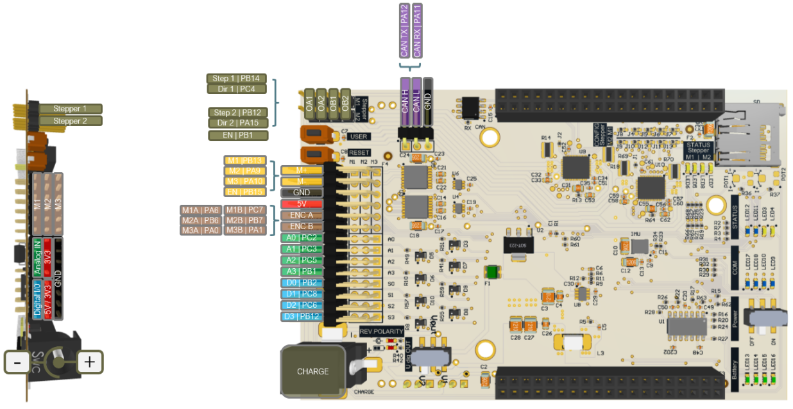

# PM2_PES_Board

Michael Peter\
pmic@zhaw.ch\
TE 307

# Table of Contents
1. [Accounts](#accounts)
2. [Arm Mbed](#arm-mbed)
    * [Mbed Studio](#mbed-studio)
3. [Hardware](#hardware)
    * [Nucleo F446RE](#nucleo-f446re)
    * [PES Board](#pes-board)

# Using the PES-Board with power On and hardware running while connected to your computer happens at your own risk

# Under now circumstances leave the battery charger connected to the PES-Board when using the PES-Board of having it connected to your computer

# Motor encoder soldering can be wrong. Do not assume that if you plug in one Motor and everything works you can the also use the same pings and everything works. You have to make sure that the physical rotation is according to your assumption and that a positive input leads to a positive change of increments.

# Depending on the PES BOARD version DCMotor M3 rotation direction might be inverted

# Depending on the PES BOARD version the Pin map might differ

- FastPWM default pwm period is 50 mus

## Accounts

It is recommendet that you use your private E-mail address to set up accounts on Mbed and on GitHub.

- Mbed: https://os.mbed.com/
- GitHub: https://github.com/

## Software

- Mbed Studio: https://os.mbed.com/studio/ Free IDE for Mbed OS application and library development
- PuTTY: https://www.putty.org/ SSH and telnet client
- Matlab or Python

## Arm Mbed

Open Source Plattform und Betriebssystem für 32-Bit-ARM Cortex-M-Mikrocontroller

### Mbed Studio

## Hardware

### Nucleo F446RE

#### Nucleo Pinout
https://os.mbed.com/platforms/ST-Nucleo-F446RE/

### PES Board

#### Pheripherals

<!--  -->

PDF: [pes_board_peripherals.pdf](./datasheet/pes_board_peripherals.pdf)

#### Pin-Mapping

PDF: [pes_board_pin_mapping.pdf](./datasheet/pes_board_pin_mapping.pdf)

## Hard- and Software Tutorials

- [ Servo ](markdown/servo.md)

