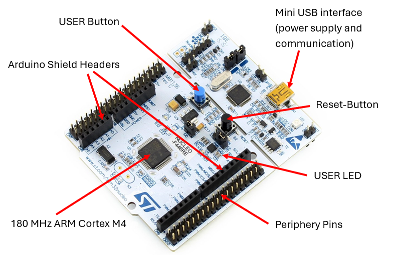
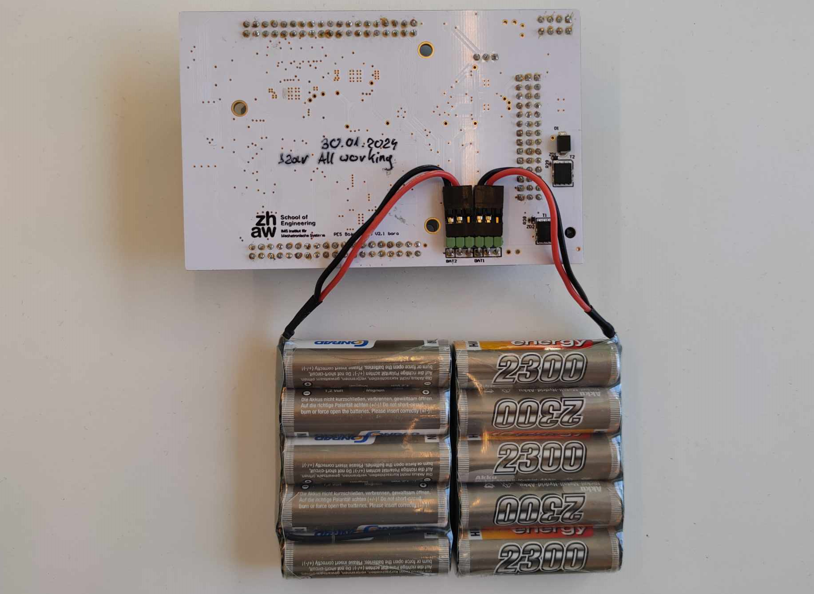
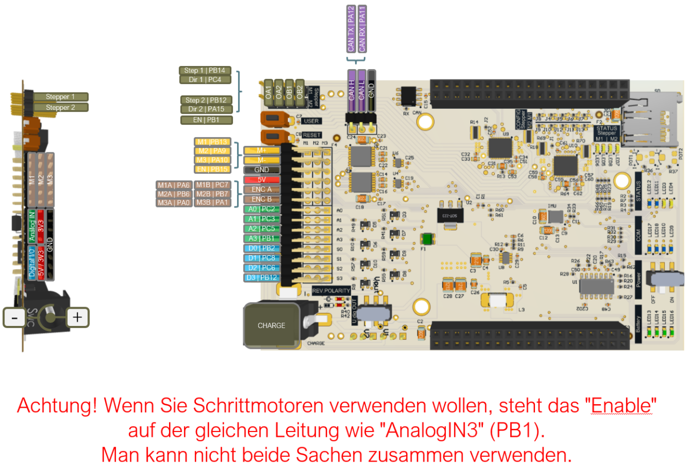

<!-- 
    Styling Rules:
    - When ever possible *.md [Links] should be used, and not just bold text
    - In a *.md [Link] all words start with a capital letter, e.g.: [Course setup]
    - A button or a pin or something similar is highlited bold: **USER BUTTON**, **PB_9**
    - Source code files are highlited bold and cursive: ***main.cpp***
    - Functions, objects and variables when not in a code snippet are formatted like this:
      - ``main()`` function
      - ``servo.enable()`` function
      - ``while()`` loop
      - ``if()`` statement
      - ``mechanical_button`` object
      - ``enable_motors`` variable
      - ``DCMotor.h`` driver
    Authors:
    - Maciej Szarek (szar)
    - Peter Michael (pichim/pmic)
 -->

<!-- link list -->
[0]: https://os.mbed.com/platforms/ST-Nucleo-F446RE/
[1]: https://www.st.com/en/microcontrollers-microprocessors/stm32f446re.html#documentation

# PM2 PES-Board, Hardware and Driver Documentation

| Szarek Maciej | Peter Michael |
|-|-|
| szar@zhaw.ch | pmic@zhaw.ch |
| TE 302 | TE 307 |

# Table of Contents
1. [Course setup](#course-setup)
    * [Accounts](docs/markdown/general_info.md#accounts)
    * [Software](docs/markdown/general_info.md#software)
    * [GitHub](docs/markdown/general_info.md#github)
    * [Arm MBed](docs/markdown/general_info.md#arm-mbed)

2. [Hardware](#hardware)
    * [Nucleo F446RE](#nucleo-f446re)
        * [Nucleo Pinmap](#nucleo-platform-pinmap)
    * [PES Board](#pes-board)
        * [Pheripherals](#pheripherals)
        * [Pin-Mapping](#pin-mapping)
    * [Hardware Tutorials](#hardware-tutorials)
        * [IR Sensor](docs/markdown/ir_sensor.md)
        * [Ultrasonic Sensor](docs/markdown/ultrasonic_sensor.md)
        * [Servo](docs/markdown/servo.md)
        * [DC Motor](docs/markdown/dc_motor.md)
        * [Line Follower Array](docs/markdown/line_follower.md)
3. [Tips](#tips)
    * [Project Development](docs/markdown/tips.md#project-development)
    * [Programming Tips](docs/markdown/tips.md#programming-tips)
    * [Structuring a Robot Task](docs/markdown/tips.md#structuring-a-robot-task)

4. [Workshops](#workshops)
    * [Workshop 1](docs/markdown/ws1.md)
    * [Workshop 2](docs/markdown/ws2.md)
    * [Workshop 3](docs/markdown/ws3.md)
5. [Links](#links)

## Course setup

In order to be able to complete the course, one must first register on the following platforms and obtain the appropriate tools. All the information needed to start the course can be found in [General Info](docs/markdown/general_info.md).

This document covers all the information about: 

- [Accounts](docs/markdown/general_info.md#accounts)
- [Software](docs/markdown/general_info.md#software)
- [GitHub](docs/markdown/general_info.md#github)
- [Arm MBed](docs/markdown/general_info.md#arm-mbed)
  
## Hardware

During the course, we will use the Nucleo-F446RE board from ST in combination with the PES board designed and developed at ZHAW. The basic hardware kid that students receive includes a variety of sensors and actuators for practical applications.

### Nucleo F446RE

The Nucleo-F446RE is a microcontroller development board featuring the STM32F446RET6 microcontroller from STMicroelectronics. It provides a versatile platform for prototyping and developing embedded systems, offering a wide range of peripherals, connectivity options, and compatibility with the Arduino and ST Morpho ecosystems.

- [STM32F446RE Documentation][1] 

      
    <i>Nucleo F446RE Overview</i>

Arm MBed provides a dedicated platform with essential information about the development board. Here you can find technical specifications and the pinmap.

- [Mbed ST-Nucleo-F446RE][0]

### PES Board

The PES Board is a hardware board with additional sensors, devices and power electronics to work in combination with the Nucleo F446RE. It provides multiple pinouts for:

- 3 DC-Motor (brushed)
- 4 Servos (these occupy the 4 DI/O if used)
- 4 DI/O, 3.3V (5V tolerant)
- 4 AI/O, 3.3V (5V tolerant)
- 3 Encoder-Counter
- 9-axis IMU (accelerometer, gyroscope, magnetometer)

><b>Important Information Related to the PES Board</b>
>- <b>Using the PES-Board with power On and hardware running while connected to your computer/laptop happens at your own risk. There was a case where the students laptop was damaged in the past.</b>
>- <b>Under now circumstances leave the battery charger connected to the PES-Board when using the PES-Board or having it connected to your computer.</b>
>- <b>Motor encoder soldering can be wrong. Do not assume that if you plug in one motor and everything works you can then also use the same connections with different motor. You have to make sure that the physical rotation is according to your assumption and that a positive input leads to a positive change of increments.</b>
>- <b>Depending on the PES Board version DCMotor M3 rotation direction might be inverted.</b>
>- <b>Depending on the PES BOARD version the Pin map might differ.</b>

The kit includes two sets of 6V battery packs, which can be connected in series to provide 12 volts. The battery packs need to be connected to the back of the PES Board. The picture below illustrates the proper battery connection required to get a total voltage of 12V.

      
    <i>Battery Packs</i>

If you are using a single battery pack, the remaining pins need to be bridged.

The batteries enables the board to be powered independently of the connection to the computer/laptop, eliminating the need for a connection via the Mini USB cable. The board continues to receive a stable 5V supply while offering the option to use a 12V supply for the power electronics of the motors. To activate the external battery power, switch the slider on the PES board to the ON position.

#### Pheripherals

      
    <i>PES Board</i>

PDF: [pes_board_peripherals.pdf](docs/datasheets/pes_board_peripherals.pdf)

#### Pin-Mapping

PDF: [pes_board_pin_mapping.pdf](docs/datasheets/pes_board_pin_mapping.pdf)

### Hardware Kid

- 2x Battery pack 6v / 2300mAh with charger
- 1x Servo – REELY S-0090
- 1x Servo – FUTABA S3001
- 1x LED green with resistor 2200/600mW/1%
- 1x Distance sensor SHARP GP2YOA41 analog 300mm with cable
- 1x DC Motor POLOLU (different gear ratios) D = 20 mm/ l = 43 mm/ 12V with encoder POLOLU 2.7 – 18V
- 1x Mechanical Button
- 1x Ultrasonic sensor GROVE ULTRASONIC RANGER V2.0 with cable

### Hardware Tutorials

The following links contain the hardware tutorials. The documents contain specifications and technical information about the hardware and information about how to use the hardware. The tutorials cover the software drivers, specific calibration procedures, controlling actuators and retrieving measurements from the sensors.

- [IR Sensor](docs/markdown/ir_sensor.md)
- [Ultrasonic Sensor](docs/markdown/ultrasonic_sensor.md)
- [Servo](docs/markdown/servo.md)
- [DC Motor](docs/markdown/dc_motor.md)
- [Line Follower Array](docs/markdown/line_follower.md)

## Tips

Tips that you might find useful can be found in the document [Tips](docs/markdown/tips.md). Here you can find information about: 
- [Project development](docs/markdown/tips.md#project-development)
- [Programming tips](docs/markdown/tips.md#programming-tips)
- [Structuring a Robot Task](docs/markdown/tips.md#structuring-a-robot-task)

## Workshops

The following links contain the workshops instructions:
- [Workshop 1](docs/markdown/ws1.md)
- [Workshop 2](docs/markdown/ws2.md)
- [Workshop 3](docs/markdown/ws3.md)

## Weblinks

### Some General Links

- Git and GitHub Tutorial for Beginners from 32:40 about Github: https://www.youtube.com/watch?v=tRZGeaHPoaw
- C++ step by step tutorials: https://www.w3schools.com/cpp/default.asp
- Detailed explanation of C++ programming language: https://cplusplus.com/
- C++ data types: https://www.tutorialspoint.com/cplusplus/cpp_data_types.htm
- Printf format convention: https://cplusplus.com/reference/cstdio/printf/
- Flowchart diagram maker: https://app.diagrams.net/

### Hardware Links

- https://www.pololu.com
- https://www.adafruit.com
- https://www.sparkfun.com
- https://www.seeedstudio.com
- https://www.robotshop.com
- https://boxtec.ch
- https://www.play-zone.ch
- http://farnell.ch
- https://www.mouser.ch
- https://www.digikey.com
- https://www.conrad.ch
- https://www.distrelec.ch