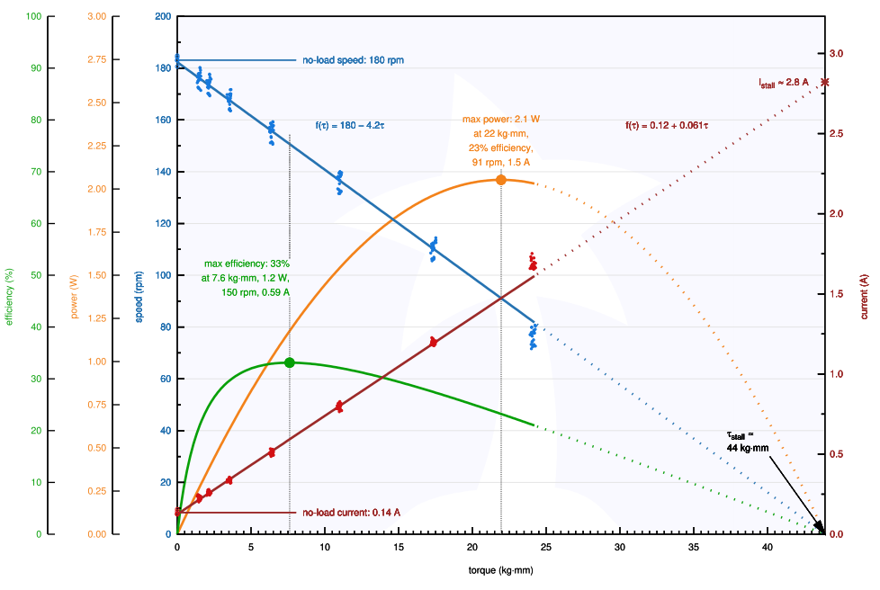
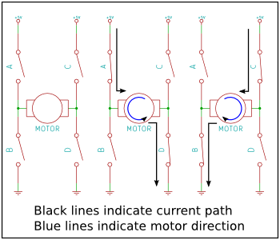
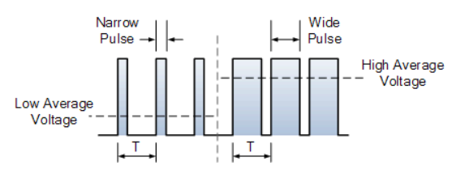
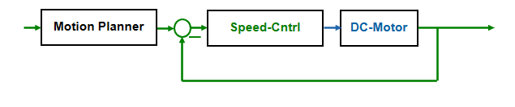
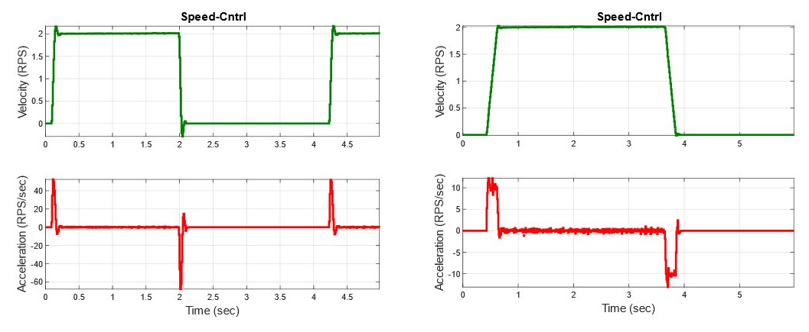
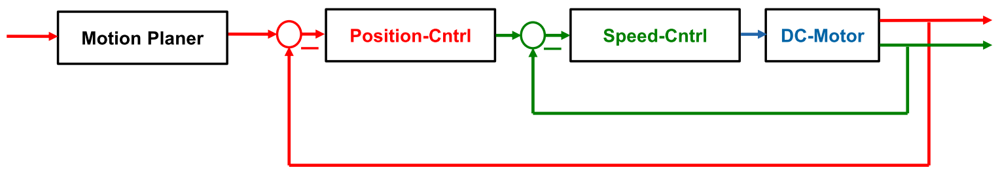
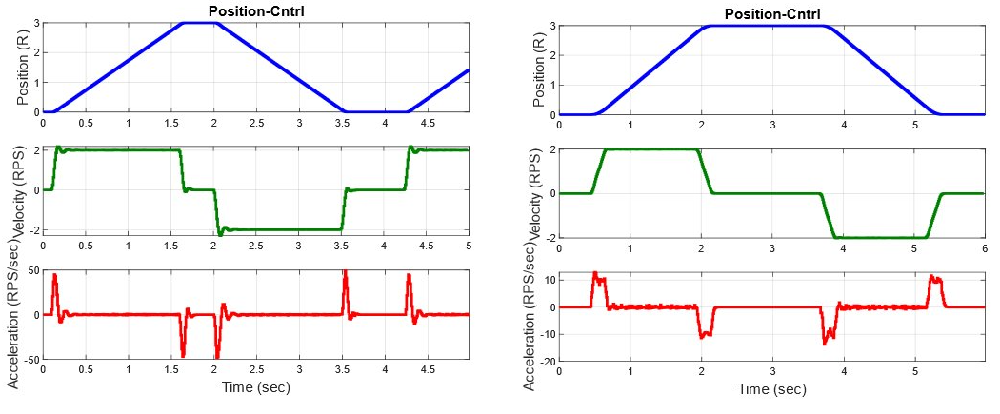
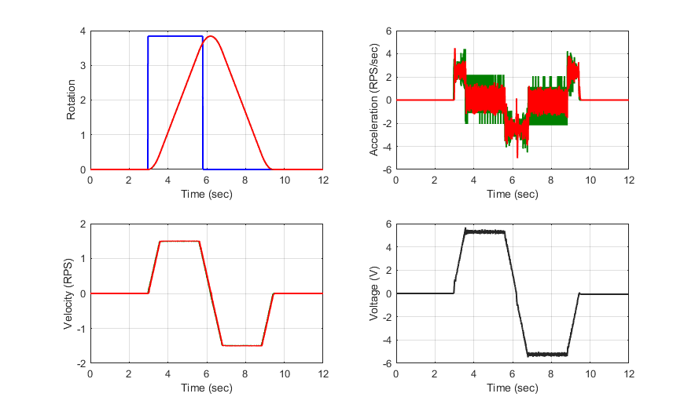

<!-- link list, last updated 15.01.2023 -->
[0]: https://www.pololu.com/product/3475/specs
[1]: https://www.pololu.com/product/3477/specs
[2]: https://www.pololu.com/product/3485/specs
[3]: https://nathandumont.com/blog/h-bridge-tutorial
[4]: https://www.electronics-tutorials.ws/blog/pulse-width-modulation.html

# DC Motor

A direct current (DC) motor is an electrical machine that converts electrical energy into mechanical energy. DC motors take electrical power through direct current, and convert this energy into mechanical rotation transmisioned by the electric field. DC motors use magnetic fields that occur from the electrical currents generated, which powers the movement of a rotor fixed within the output shaft. The output torque and speed depends upon both the electrical input and the design of the motor.

<p align="center">
     </br>
    <i>Example of a brushed DC Motor with an Encoder</i>
</p>

## Technical Specifications

| | 31:1 Metal Gearmotor 20Dx41L mm 12V CB | 78:1 Metal Gearmotor 20Dx43L mm 12V CB |488:1 Metal Gearmotor 20Dx46L mm 12V CB|
|-|-|-|-|
|**Dimensions**|
|Size                     | 20D x 43.2L mm | 20D x 44.7L mm |20D × 47.7L mm|
|Weight                   | 44 g           | 45 g           | 47 g         |
|Shaft diameter           | 4 mm           | 4 mm           | 4 mm         |
|**General specifications**|
|Gear ratio               | 31.25:1        | 78.125:1       | 488.28125:1  |
|No-load speed @ 12V      | 450 rpm        | 180 rpm        | 28 rpm       |
|Stall torque @ 12V       | 0.24 Nm        | 0.53 Nm        | 2.45 Nm      |
|Max output power @ 12V   | 2.8 W          | 2.5 W          | 1.5 W        |
|No-load speed @ 6V       | 225 rpm        | 90 rpm         | 14 rpm       |
|Stall torque @ 6V        | 0.12 Nm        | 0.26 Nm        | 1.27 Nm      |
|**Encoder**|
|Resolution               | 20 (5)         | 20 (5)         | 20 (5)       |

## Links

[31:1 Metal Gearmotor 20Dx41L mm 12V CB][0] <br>
[78:1 Metal Gearmotor 20Dx43L mm 12V CB][1] <br>
[488:1 Metal Gearmotor 20Dx46L mm 12V CB][2] <br>

## Datasheets including measrued static Characteristics

[20D Pololu Motors](../datasheets/pololu-20d-metal-gearmotors.pdf)

## Static Characteristics of the 78:1 Metal Gearmotor 20Dx43L mm 12V CB

<p align="center">
     </br>
    <i>Approximate static characteristics of 78:1 DC Motor</i>
</p>

- The above static motor characteristics represent measured and interpolated data from the 78:1 DC Motor. The static characteristics from other gear boxes ca be found in the datasheet [20D Pololu Motors](../datasheets/pololu-20d-metal-gearmotors.pdf). It is advisable to make informed decisions and choices when selecting the motors. Incorporating safety margins to account for possible inaccuracies or variations and avoid operating the motors at their limiting boundaries. The main takeaways from the characteristics can be summarized as follows:
  - The relation between speed and voltage is linear (not visible in the graph), the more voltage that is applied, the higher the rotational speed. The gain that maps voltage to speed is called the motor constant and for the 78:1 DC Motor the value is 180 RPM / 12 V = 0.25 RPM/V or 0.25 RPS/V.
  - The relation between current and torque is also linear, the more current that is flowing throught the coils, the more torque is applied.
  - At zero torque we can reach a maximum speed of 180 RPM at 12V. The maximum speed can only be reached when the motor is not under load.
  - At maximum torque the motor is not able to rotate / accelerate anymore, all energy is used to apply the torque.
- Doubling the gear ratio of the motor will approximately double the torque and halve the speed. It is recommended to use the datasheets to find the right motors for the application though.
- During the design and evaluation process, using the static motor characteristics is crucial for the appropriate motor selection.

## Encoder and Relative Positioning

- The magnetic encoder is a sensor device that uses magnets to measure the angle of the motor. It consists of a magnetically encoded disk attached to the rotating part and a sensor that detects changes in the magnetic field, converting them into electrical signals (pulses). Counting these pulses provides information about the angle of the motor. Computing the time derivative of the angle nummericaly provides the angular velocity of the motor.
- It's very important to understand that the used magnetic encoders provide relative position information. This means that the encoder only returns counts about changes in position relative to the point where it was initialized/started counting, and the initial position upon power-up is considered as the zero reference point. Therefore and only if absolute measruments are needed a homing procedure needs to be done after every startup uf the system. The accuracy of the measurements relies on the consistency of this referencing. Any absolute positioning requires additional sensors and additional code to perform the homing procedure.

## Practical Tips

- It's important to note that any closed-loop controled motors can only work properly when the encoder readings align with the motor's rotation direction. To ensure proper operation, establish the positive direction first, then connect the components to ensure both the rotation direction and encoder readings are positive. To alter the motor's movement direction, adjust the power supply connection to the M1 and M2 outputs accordingly. To change the positive measurement direction do the same for the encoder ans swap the A and B cables. 

## DC Motor Driver

The ``DCMotor`` class is a versatile tool designed for controlling the velocity and/or rotation of a DC motor. It incorporates essential components like an EncoderCounter, FastPWM, Motion control, PID controller, and an IIR Filter to ensure accurate control. This class provides user-friendly methods for adjusting velocity, rotation, control gains, and obtaining the current state of the motor, offering a comprehensive set of functionalities for motor control.

To start working with the DC motor, it is necessary to plug it correctly and create an object in the ***main.cpp*** file and assign the correct pins.

### Connection to the PES Board

DC motors have assigned pins on the PES Board. Seen from the motor, **PWM** is the input and **ENC** (Encoder) is the output of the system:

```
// PES-Board Pin Names
PB_PWM_M1
PB_PWM_M2
PB_PWM_M3

PB_M1_ENC_A
PB_M1_ENC_B
PB_M2_ENC_A
PB_M2_ENC_B
PB_M3_ENC_A
PB_M3_ENC_B

PB_ENABLE_DCMOTORS
```

[PES Board pinmap](../datasheets/pes_board_peripherals.pdf)

### Hardware Pins on the Motor

Pins M1 and M2 represent the output of the H-Bridge, so voltage plus (+) and minus (-). VCC and GND pins provide power to the encoder, while pins A and B are the encoder signals.

### Enabling the Power Electronics

The PES Board can control up to 3 DC motors. Configuring the driver involves setting up the PWM pins, essential for adjusting the voltage that gets applied.
<details Closed>
<summary><b>H-bridge and PWM</b></summary>

><p align="center">
>     </br>
>    <i>H-bridge Example</i>
></p>
> An H-bridge is a configuration of four switches that enables precise voltage control. These switches, typically transistors or MOSFETs are arranged in a shape of an "H" determine the voltage and therefor the current flow through the motor. By selectively activating different pairs of the switches, the H-bridge can apply positive and negativ voltages to the motor, allowing it to rotate in both directions. The H-bridge is controlled by the PWM signal, which is generated by the microcontroller and applied to the H-bridge.
><br>
><br>
><p align="center">
>     </br>
>    <i>PWM with altering Duty Cycle</i>
></p>
>Pulse Width Modulation (PWM) in DC motor control means varying the duty cycle of a rapidly switching signal to regulate the average voltage applied to the motor. By adjusting the duty cycle of the PWM, the average voltage is adjusted accordingly.
><br>
><br>

> - Further information about H-bridges can be found [here][3].
> - Further information about PWM and DC motors can be found [here][4].
</details>

<br>

To power the DC motors, connect the two battery packs to the back of the PES Board. Each battery back delivers approx. 6V, resulting in 12V total (parallel). If your are using only one battery pack you have to bridge the remaining pins on the back of the PES Board. Turn on the PES Board by using the ON/OFF switch. After turning on the power, enable the external power electronics (H-bridge) by creating a ``DigitalOut`` object and set the digital out to 1 (or true). This object needs to be created alongside other necessary variables and objects.

<br>

```
// create object to enable power electronics for the DC motors
DigitalOut enable_motors(PB_ENABLE_DCMOTORS);
```

To complete the motor activation process, set the value of the object to 1, enabling the power electronics.

```
// enable hardwaredriver DC motors: 0 -> disabled, 1 -> enabled
enable_motors = 1; // setting this once would actually be enough
```

### Create DC Motor Object and Command the DC motor

The provided examples show three different used cases of a DC motor and how to use the ``DCMotor`` class. We assume that we have three DC motors and encoders that are plugged into pins **M1 - M3** on the PES board. You can also test each used case separately when only one DC motor is available.
- [Motor M1](#motor-m1-open-loop) is used Open-Loop
- [Motor M2](#motor-m2-closed-loop-velocity-control) is used Closed-Loop Velocity Control (Rotations per Second)
- [Motor M3](#motor-m3-closed-loop-position-control) is used Closed-Loop Position Control (Rotations)

#### Motor M1 Open-Loop

To use Motor M1 in an open loop configuration (no feedback, therefor no encoder needed), start by adding the ``FastPWM.h`` driver to the ***main.cpp*** file. Next, create an object by passing the pin names as arguments. 

```
#include "pm2_drivers/FastPWM/FastPWM.h"
```

Then a ``FastPWM`` object needs to be created, which is used to command the voltage applied to the DC motor:

```
// motor M1
FastPWM pwm_M1(PB_PWM_M1); // create FastPWM object to command motor M1
```

Motor M1 is used open-loop, meaning we just apply a certain voltage to the motor. The relation between the applied voltage and the speed is linear and the gain that maps voltage to speed is called the motor constant. The mapping is (0.0f...1.0f) $\rightarrow$ (-12V...12V):
- PWM input 0.0f $\rightarrow$ -12V is applied to the motor
- PWM input 0.5f $\rightarrow$ 0V
- PWM input 1.0f $\rightarrow$ 12V

A positive voltage will cause the motor to rotate in one direction and a negative voltage will cause the motor to rotate in the opposite direction. You can alter the rotating direction by changing the cables connected to the motor (connections to M1 and M2).

```
pwm_M1.write(0.75f); // apply 6V to the motor
```

#### Motor M2 Closed-Loop Velocity Control

Since we are reusing the pins from M1, we can leave the motor connected to M1. To be able to use the DC motor in a velocity controlled closed loop comment out the previous code for motor M1, e.g.:

```
// // motor M1
// FastPWM pwm_M1(PB_PWM_M1); // create FastPWM object to command motor M1
...
// pwm_M1.write(0.75f); // apply 6V to the motor
```

Motor M2 operates in a closed loop to control the velocity. To be able to use this functionallity it is necessary to include the ``DCMotor.h`` driver in the ***main.cpp*** file.

```
#include "pm2_drivers/DCMotor.h"
```

When declaring a ``DCMotor`` object for closed-loop control, it is necessary to specify the following arguments related to the motor parameters. Including gear ratio, motor constant, and the maximum available voltage based on the number of battery packs you are using.

The following code illustrates the declaration of all necessary parameters to set up a  ``DCMotor`` object:

```
const float voltage_max = 12.0f; // maximum voltage of battery packs, adjust this to
                                    // 6.0f V if you only use one battery pack

// motor M2
const float gear_ratio_M2 = 78.125f; // gear ratio
const float kn_M2 = 180.0f / 12.0f;  // motor constant
// it is assumed that only one motor is available, there fore
// we use the pins from M1, so you can leave it connected to M1
DCMotor motor_M2(PB_PWM_M1, PB_ENC_A_M1, PB_ENC_B_M1, gear_ratio_M2, kn_M2, voltage_max);
motor_M2.enableMotionPlanner(true);
```

To receive the measured velocity/speed, include the following command inside the ``while()`` loop that prints motor speed values to the serial terminal. This allows us to verify the correctness of the connection, ensuring that the motor's rotation direction aligns with our expectations and corresponds to the displayed speed values.

```
printf("Motor velocity: %f \n", motor_M2.getVelocity());
```

**NOTE:**
- If the motor start spinning immediatly after enabling the hardware with maximum speed, the motor is connected incorrectly and the cables for M1 and M2 from the PES Board to the motor or the cables from the encoder A and B need to be swapped.
- The maximum physically possible velocity is calculated and set in the driver based on the input arguments.
  
The default motor driver does not activate the motion planner, meaning the speed setpoint will be reached as quickly as possible. To test this, you can place the following command inside the ``while()`` loop.

```
motor_M2.setVelocity(motor_M3.getMaxVelocity() * 0.5f); // set speed setpoint to half physical possible velocity
```

Nevertheless, the driver is designed to be able to command the motor with smooth movements using a motion planner. This motion planner or trajectory generator creates acceleration and speed limited trajectories.

<p align="center">
     </br>
    <i>DC Motor Velocity Control Block Diagram</i>
</p>

To be able to use the motion planner, the module needs to be activated with the following command, that is placed below the DC motor declaration:

```
// enable the motion planner for smooth movement
motor_M2.enableMotionPlanner(true);
```

Below are graphs of the measured velocity and acceleration versus time without and with the motion planner active. The graph on the left shows step responses without the motion planner active. The velocity overshoots the setpoint and the acceleration of the motor is larger and more abrupt. The graph on the right shows step responses with the motion planner active. The speed value reaches setpoint without any overshoot and the acceleration is smaller and bounded leading to smooth movements of the drive.

<p align="center">
     </br>
    <i>DC Motor Velocity and Acceleration with and without Motion Planner</i>
</p>

Adjustments to the maximum acceleration can be done by using the following command (which should be placed after declaring the ``DCMotor`` object):

```
// limit max. acceleration to half of the default acceleration
motor_M2.setMaxAcceleration(motor_M2.getMaxAcceleration() * 0.5f);
```

**IMPORTANT NOTE:**

- You can swap seamlessly between speed and position control by applying the appropriate commands to the motor. The motor driver will automatically switch between the two control modes.

#### Motor M3 Closed-Loop Position Control

Since we are reusing the pins from M1, we can leave the motor connected to M1. To be able to use the DC motor in a position controlled closed loop comment out the previous code for motor M2, e.g.:

```
// // motor M2
// const float gear_ratio_M2 = 78.125f; // gear ratio
// const float kn_M2 = 180.0f / 12.0f;  // motor constant
// // it is assumed that only one motor is available, there fore
// // we use the pins from M1, so you can leave it connected to M1
// DCMotor motor_M2(PB_PWM_M1, PB_ENC_A_M1, PB_ENC_B_M1, gear_ratio_M2, kn_M2, voltage_max);
// motor_M2.enableMotionPlanner(true);
```

To use Motor M3 in closed loop for position control, we insert the following code snipped:

```
// motor M3
const float gear_ratio_M3 = 78.125f; // gear ratio
const float kn_M3 = 180.0f / 12.0f;  // motor constant
// it is assumed that only one motor is available, there fore
// we use the pins from M1, so you can leave it connected to M1
DCMotor motor_M3(PB_PWM_M1, PB_ENC_A_M1, PB_ENC_B_M1, gear_ratio_M3, kn_M3, voltage_max);
// enable the motion planner for smooth movement
motor_M3.enableMotionPlanner(true);
// limit max. velocity to half physical possible velocity
motor_M3.setMaxVelocity(motor_M3.getMaxPhysicalVelocity() * 0.5f);
```

Update the printing command to print the number of rotations:

```
printf("Motor position: %f \n", motor_M3.getRotation());
```

Then include the command that will rotate the motor 3 times:

```
motor_M3.setRotation(3.0f);
```

<p align="center">
     </br>
    <i>DC Motor Position Control Block Diagram</i>
</p>

Below are graphs of position, velocity and acceleration against time. On the left are the graphs when the motion planner is not active and on the right when the motion planner is active.

<p align="center">
     </br>
    <i>DC Motor Position, Velocity and Acceleration with and without Motion Planner</i>
</p>

In the following graph a smooth positioning step of a DC motor is shown in more detail. In the first graph (upper left corner), the blue line represents the position setpoint, while the red line represents the actual position. Notably, the red line exhibits smooth transitions at the beginning and end, indicative of uniform acceleration and deceleration. The speed graph illustrates the motor speed increase to its maximum speed, maintaining it constantly before decelerating constantly. After this, the process repeats in the opposite direction. Given the direct proportionality between speed and voltage, the voltage graph mirrors the speed graph's curve. The acceleration graph showcases an initial acceleration phase, followed by quantization noise around zero when the shaft moves at a constant speed. It is important to note that the motor was not under load.

<p align="center">
     </br>
    <i>Smooth Positioning of 78:1 DC Motor</i>
</p>