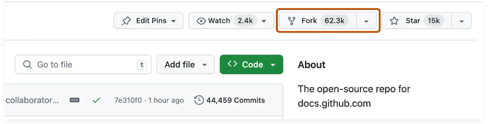
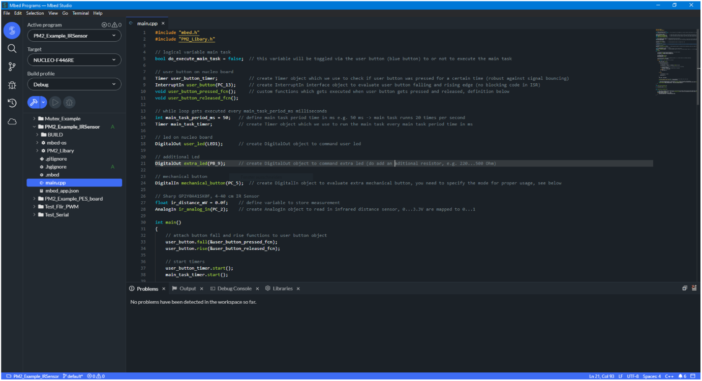
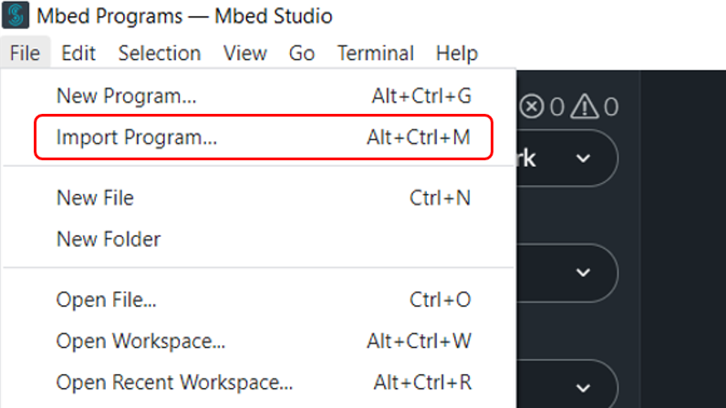
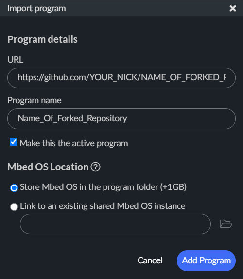
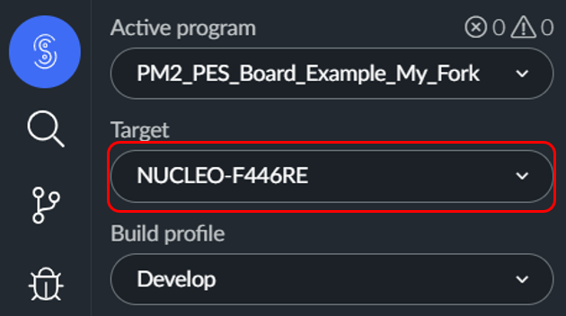
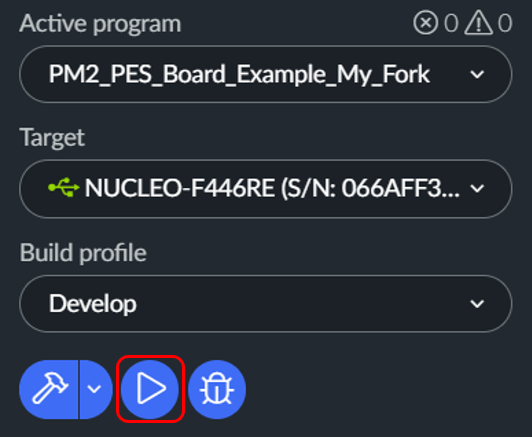

# Course Setup

This site guides you through the essential steps to begin the course, starting from creating accounts on required platforms to downloading the relevant software used during the workshops and for your project.

## Accounts

It is recommended that you use a private E-mail address to set up accounts on Mbed and on GitHub. To be able to use Matlab it is mandatory to use the account from your university because of the corresponding license.

- GitHub: https://github.com/ Private E-mail
- Mbed: https://os.mbed.com/ Private E-mail
- Matlab: https://matlab.mathworks.com/ University account

## Software

- Mbed Studio: https://os.mbed.com/studio/ Free IDE for the Mbed OS ecosystem
- PuTTY: https://www.putty.org/ SSH and telnet client
- Matlab: https://matlab.mathworks.com/  Programming and nummerical computing platform

## GitHub

GitHub is a web-based platform from Microsoft for version control using Git, facilitating collaborative software development by providing tools for code hosting, tracking changes, and managing project workflows. It allows developers to work on projects simultaneously, merge their changes seamlessly, and track the project's history. GitHub is widely used in the software development community for code collaboration, issue tracking, and hosting open-source projects.

* To create a fork of PM2 PES Board Example repository you need to go to the repository Github: https://github.com/pichim/PM2_PES_Board_Example
* On the top right corner click **Fork**:

      
    <i>Forking the Repository</i>

* By default, forks are named the same as their upstream repositories. Optionally, to further distinguish your fork, in the "Repository name" field, type a different name.
* Click **Create fork**.

By forking the repository, you can freely experiment with changes without affecting the original project. This fork is now your own version of the repository. You can make changes to files and push commits to your fork's branch.

## Arm Mbed

Arm Mbed is a comprehensive embedded systems development platform, it offers a range of tools, libraries, and acces to a real time C++ based OS to simplify and accelerate the development process for Arm-based microcontrollers. Mbed provides a unified and scalable environment, supporting diverse applications in the field of embedded systems and IoT.

### Mbed Studio

Arm Mbed Studio is an integrated development environment (IDE) designed for embedded systems. It offers a user-friendly interface with features such as a powerful code editor, compiler, and debugger, streamlining the process of coding for Arm-based microcontrollers. Mbed Studio supports Mbed OS and enables seamless development, compilation, and debugging of embedded applications in a single environment.

      
    <i>Mbed Studio</i>

### MBed OS Version

During the course we are working with MBed OS version 6. It is important to keep this in mind when you are looking for documentation or examples on the internet. There are many examples from older versions of MBed OS, especially MBed OS 2 but we need MBed OS 6.

### Importing Your First Project

Importing a program from GitHub to Mbed Studio involves linking the local repository with Mbed Studio, enabling seamless collaboration and development on the chosen project:
* Once MBed Studio is installed, the next step involves creating the program intended for use during the class. This program should be imported from the previously forked repository. Open the **File** menu and select **Import Program**

      
    <i>Importing the Program</i>

* Visit the GitHub page of your repository (e.g., https://github.com/YOUR_NICK/NAME_OF_FORKED_REPOSITORY) and copy the **HTTPS** URL, located below the box on your forked repository.

      
    <i>HTTPS link GitHub</i>

* Paste the full **HTTPS** URL of the relevant web page and (optionally) edit the program name.
* If you are changing the **Project name**, it is a good a practice to name projects with capital letters, so they can be distinguished from libaries (lowercase letters).

      
    <i>Importing Program 1</i>

* Then click **Add program**, by default this will be the active program in MBed Studio.
* To complete the setup you need to choose the **Target** by typing the Nucleo Board type that will be used: In our case **NUCLEO-F446RE**.

      
    <i>Importing Program 2</i>

### Building a Program

Building a program in Mbed Studio involves the process of compiling and linking the source code to create an executable binary file (***.bin** file) that can run on the specific microcontroller. The build process ensures that the code is translated into machine code compatible with the target platform. Once the program is successfully built, the resulting binary file can be loaded onto the microcontroller board to execute the desired functionality.

In Mbed Studio, there are three build profiles:

1. **Debug Profile:**
   - **Purpose:** Primarily used for debugging and development.
   - **Optimizations:** Limited optimizations to aid debugging, resulting in larger binaries.
   - **Symbols:** Includes debugging symbols to facilitate source-level debugging.
   - **Compile Time:** Longer compile times due to additional information included.

2. **Develop Profile:**
   - **Purpose:** Balanced profile for development and testing.
   - **Optimizations:** Moderate level of optimizations to balance size and performance.
   - **Symbols:** Includes debugging symbols for effective debugging.
   - **Compile Time:** Moderate compile times.

3. **Release Profile:**
   - **Purpose:** Optimized for production or release.
   - **Optimizations:** High level of optimizations for smaller and faster binaries.
   - **Symbols:** Debugging symbols are excluded, reducing binary size.
   - **Compile Time:** Faster compile times compared to debug profiles.

Choosing the appropriate build profile depends on the development stage and requirements. Debug profiles aid in effective debugging, Develop profiles offer a balanced compromise, while Release profiles optimize for size and performance in production environments. We generally work with the **Develop Profile**.

The build process can be performed without a connected board. After importing the program, specify build profile and initiate the build process by clicking the **HAMMER** button.

      
    <i>Building the Program</i>

The compiled files, including the ***.bin** file are stored in the **BUILD** directory within your project folder. 

### Flashing

Flashing the microcontroller involves programming its non-volatile memory with the compiled binary of your program, enabling it to execute the code during startup. After building your program and connecting the board to your computer, click the **PLAY** button in Mbed Studio to initiate the flashing process. This transfers the compiled binary to the microcontroller's memory, making it ready to run the programmed code.

      
    <i>Flashing the Board</i>

To apply code changes, you can simply click the **PLAY** button, prompting Mbed Studio to build the code and flash it to the microcontroller.

**NOTE:**

- Periodically deleting the build folder and re-building the program is recommended to avoid potential interference that may arise from adding new code.

## Navigating the Environment

### Connected Board

Upon connecting the Nucleo Board to your computer, it is recognised as an additional drive. This drive represents the built-in mass storage feature facilitated by the Nucleo Board's on-board ST-Link programmer/debugger. Detected as a removable drive, it often adopts a name like "NODE_F446RE" (based on the specific Nucleo model).

This drive serves as a convenient avenue for transferring the compiled binary (firmware) of your program to the Nucleo Board. You can easily drag and drop the compiled binary file onto this drive, and the ST-Link interface will subsequently flash the microcontroller's memory with the updated firmware. This process is integral to the flashing or programming step, ensuring your microcontroller running the latest code.

### File Storage Location

In Mbed Studio, the Mbed project folder is typically situated in the workspace directory where you created or imported the project. To locate the Mbed project folder and the ***.bin** file:

<b>1. Project Folder Location:</b>

Windows: ``C:\Users\UserName\Mbed Programs\Project``

<b>2. Locating the *.bin File:</b>

Windows: ``"C:\Users\UserName\Mbed Programs\Project\BUILD\NUCLEO_TYPE\ARMC6\Project.bin"``

#### Flashing the Microcontroller by Drag and Drop

This ***Project.bin*** file is the compiled binary that can be flashed to the microcontroller. To flash the binary just drag and drop the file the the drive representing your microcontroller.