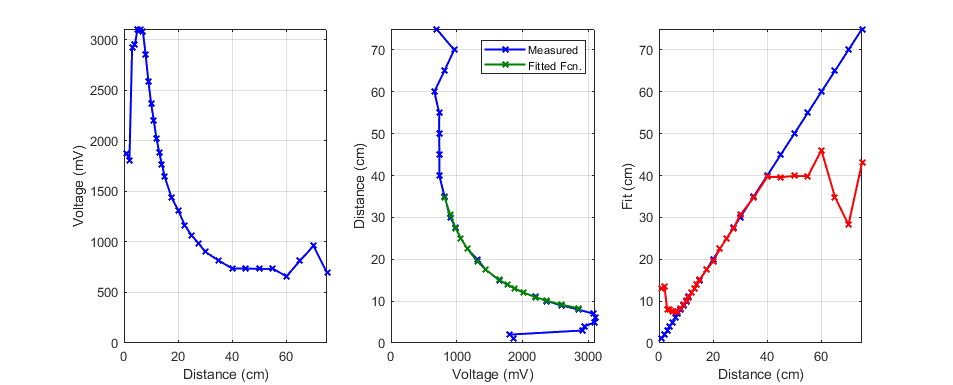

# Analog distance sensor

The analog distance sensor which is equipped with IR diode utilizes triangulation to accurately measure distances. Using infrared technology, it calculates distances by measuring angles, establishing precise spatial relationships. This device emits infrared light, observes reflections, and provides reliable real-time distance measurements. Valuable for tasks requiring precise distance determination, it serves as a versatile solution for applications like navigation, mapping, and object localization.


<details Closed>
<summary><b>How does it work?</b></summary>

>Very briefly infrared sensors work on the principle of reflected light waves. Infrared light reflected from objects or sent from an infrared remote or beacon. Infrared sensors can be used to measure distance or proximity. The reflected light is detected and then an estimate of the distance between the sensor and the object is calculated. The following is a pictorial representation of the principle of operation:
><center></center>
><center> <i>Principle of operation</i> </center>
>
> More detailed explanation can be found: [HERE][4]

</details>

<center></center>
<center> <i>Example of IR distance sensor</i> </center>

## Technical Specifications
| | | | Sharp GP2D120 | Sharp GP2Y0A21YK0F | Sharp GP2Y0A02YK0F|
|-|-|-|-|-|-|
| |Symbol|Conditions| | | |
|**Absolute Maximum Ratings**       |    |Ta=25 °C, Vcc = 5 VDC|                                    |                                    |                          |
|Supply Voltage                     |Vcc |                     |-0.3 to +7 V                        |-0.3 to +7 V                        |-0.3 to +7 V              |
|Output Terminal Voltage            |Vo  |                     |-0.3 to (Vcc +0.3) V                |-0.3 to (Vcc +0.3) V                |-0.3 to (Vcc +0.3) V      |
|Operating Temperature              |Topr|                     |-10 to +60 °C                       |-10 to +60 °C                       |-10 to +60 °C             |
|Storage Temperature                |Tstg|                     |-40 to +70 °C                       |-40 to +70 °C                       |-40 to +70 °C             |
|**Operating Supply Voltage**                                                                                                               |
|Supply Voltage                     |Vcc |                     |4.5 to 5.5 V                        |4.5 to 5.5 V                        |4.5 to 5.5 V              |
|**Electro-optical Characteristics**|    |Ta=25 °C, Vcc = 5 VDC|                                    |                                    |                          |
|Measuring Distance Range           |ΔL  |                     |(MIN) 4.00 (TYP) ---- (MAX) 30.0 cm |(MIN) 10.0 (TYP) ---- (MAX) 30.0 cm |(MIN) 20.0 (TYP) ---- (MAX) 150 cm |
|Output Terminal Voltage            |Vo  |at max range         |(MIN) 0.25 (TYP) 0.40 (MAX) 0.55 V  |(MIN) 0.25 (TYP) 0.40 (MAX) 0.55 V  |(MIN) 0.25 (TYP) 0.40 (MAX) 0.55 V |
|Output Terminal Difference         |ΔVo |between range limits |(MIN) 1.95 (TYP) 2.25 (MAX) 2.55 V  |(MIN) 1.65 (TYP) 1.90 (MAX) 2.15 V  |(MIN) 1.80 (TYP) 2.05 (MAX) 2.30 V |
|Average Supply Current             |Icc |at max range         |(MIN) ---- (TYP) 33.0 (MAX) 50.0 mA |(MIN) ---- (TYP) 30.0 (MAX) 40.0 mA |(MIN) ---- (TYP) 33.0 (MAX) 50.0 mA |

## Links

[Sharp GP2D120][1]

[Sharp GP2Y0A21YK0F][2]

[Sharp GP2Y0A02YK0F][3]

<!-- link list, last updated 07.12.2023 -->
[1]: https://www.pololu.com/product/1136
[2]: https://www.pololu.com/product/136
[3]: https://www.pololu.com/product/1137
[4]: https://robocraze.com/blogs/post/ir-sensor-working
[5]: https://os.mbed.com/platforms/ST-Nucleo-F446RE/

## Datasheets

[Sharp GP2D120](../datasheets/GP2D120-DATA-SHEET.pdf)

[Sharp GP2Y0A21YK0F](../datasheets/gp2y0a21yk0f.pdf)

[Sharp GP2Y0A02YK0F](../datasheets/gp2y0a02yk_e.pdf)

## Practical Tips

* Remember that reliable measurements can only be made within the measurement range. Be especially careful near the minimum range because of its course near this point (see distance measuring characteristics chart in the technical documentation of the sensor).
* It is important to note that the underlying principle of this measurement method is contingent upon the reflection of a light beam. Consequently, the measurement is significantly influenced by the surface of the reflecting object. Measuring from objects with a surface that reflects light rays poorly may give incorrect results.

## Analog distance sensor

The ``AnalogIn`` class is a class that belongs to the libraries created by the MBed platform assigned to the board in use. The driver maps the input signal received from 0...3.3V to 0...1. This should be kept in mind when using the sensor to interpret the signal correctly.

To start working with the sensor, it is necessary to plug it correclty and create an object in the ``main`` file and assign a analog input.

### Connection to the Nucleo-Board
---------------------------
According to the sensor documentation, it is necessary to power the sensors with 5.0V to ensure the reception of accurate signals. It is evident that three wires emerge from the sensor: one for signal transmission, another for ground, and the last one for power supply. The transmission wire should be connected to the pin that allows the reception of an analog signal, in our example this is the **PC_2** pin.

[Nucleo Board pinmap][5]

If you are not sure how to connect the sensor, click the following hint.

<details Closed>
<summary>Some of the Nucleo F446RE Pin Map</summary>
<br>
<center></center>
<center> <i>Connection Pin map with marked wire's colors </i> </center>
</details>


### Create analog distance sensor object
---------------------------
As previously mentioned, the transmission wire of the sensor in this example is connected to pin **PC_2** on the Nucleo-Board. The appropriate driver, responsible for reading values from the sensor, is already included in the mbed drivers declared at the beginning of the ``main`` file.

```
#include "mbed.h"
```

Proceed to create an object with the pin's name passed as an argument and define a variable to store the corresponding value read from the sensor in millivolts.

```
float ir_distance_mV = 0.0f;
AnalogIn ir_analog_in(PC_2);
```

### Calibration
---------------------------
The sensor returns distances in millivolts, there for it is necessary to convert the signal to a unit of length. To do this, it is essential to determine the function that converts the signal from millivolts into distance measure values, e.g. centimeters. This function is determined by the calibration process. The calibration process is described in the folowing section.

<details Closed>
<summary><b>For what do we need calibration?</b></summary>

>Calibrating an IR distance sensor is essential to establish a precise relationship between the sensor's analog voltage readings and actual distances. This process ensures accuracy, accounting for sensor variations and environmental factors, and is vital for reliable distance measurements in diverse applications. In the technical documentation it is possible to find a dependency between voltage readings and distance such as the following:
>
><center></center>
><center> <i>Distance measuring characteristics</i> </center>
>These are expected values that can serve as a reference for the measurements to be made. However, all sensors, especially those of lower quality (hobby grade), may be characterized by a slightly altered course of the curve in question, so a calibration process should be carried out before using each sensor for an application where the distance needs to measured acccurately.

</details>

<br>

The first step of the procedure is the simultaneous measurement of the actual distance and the corresponding voltage readings received from the sensor for several distances. Once the values have been measured, it is best to use a program like MATLAB/Python for data processing, where the measurements can be evaluated and further processed. The goal is to approximate the measured characteristics from millivolts to distance in cm as a non-linear function (a map) and determine the coefficients of the the function that converts the signal from millivolts into a distance. The solution to this problem will be done via nummerical opitimazitaion. A list of hardware and files needed to perform the calibration can be found below:

>Hardware:
> - NUCLEO-F446RE board
> - IR sensor (check which one you have, the model name is on the side, it will determine the range of measurement)
> - Mini USB cable
> - Additional wires to connect the sensor to the NUCLEO board
> - Paper tape
> - Length measure tape
>
> Software:
> - Matlab file: [IR sensor evaluation](../matlab/ir_sensor_eval.m)

#### Procedure

- Tape the paper tape to the floor from the edge of the wall and use a tape measure to mark the measurement points on the tape (e.g. 0 to 15cm every 1cm, then 17.5 to 30cm every 2.5cm and 35 to 75cm every 5cm, may vary depending on the sensor)
<center></center>
<center> <i>Performing the exercise</i> </center>

- To read the values measured by the sensor, it is essential to include a command that will be executed every iteration of the program. There for, this command is positioned within the *while* loop. The command will start reading sensor values after starting the program execution with the **USER** button. 

```
ir_distance_mV = 1.0e3f * ir_analog_in.read() * 3.3f;
```
**Notes:**
- Keep in mind that the signal is mapped to a range of 0 to 1. Consequently, the reading is multiplied by 3.3, representing the maximum range of the sensor, and then by 1000 to convert the signal from volts to millivolts.

- To continuously receive printouts on the serial monitor, incorporate the command within a while loop, ensuring constant output regardless of the main task execution:

```
printf("IR distance mV: %f \n", ir_distance_mV);
```

- To reset the variables to initial values without restarting the program, add command in the else statement, triggered by pressing the **USER** button while program is running.

```
ir_distance_mV = 0.0f;
```

- Once the above commands are written, the next step is to compile and run the application.
- During the calibration process, position the sensor's edge at the marked points on the tape. The sensor should face the wall to measure the distance from, and it's important to align the sensor beam parallel to the ground. Simultaneously, note the distance and the corresponding readout values displayed on the serial monitor after applying it to each designated point.
- After collecting the data points, input them into [ir_sensor_eval.m](../matlab/ir_sensor_eval.m) under the respective headings dist_cm and dist_mV. This file aids in determining the coefficients for the optimal-fit curve. To achieve accurate results, it's crucial to define a suitable range of values for the curve fitting, as this range establishes the sensor minimum and maximum range.
- Following this, proceed to create a function that converts the sensor readings into a physical length (cm). While the function definition can be positioned at the end of the ``main`` file, it must be declared before *main* function to ensure successful compilation.

Function definition (at the end of the **main** file)

```
float ir_sensor_compensation(float ir_distance_mV) {

    // insert values that you got from the MATLAB file
    static const float a = 0.0f;
    static const float b = 0.0f;

    // avoid division by zero by adding a small value to the denominator
    if (ir_distance_mV + b == 0.0f)
        ir_distance_mV -= 0.001f;

    return a / (ir_distance_mV + b);
}
```

After writing the function, take a close look at how it is structured, are there mathematical operations in it, where exceptional values of variables, can cause the execution of forbidden mathematical operations?

Possible situation:

```
(ir_distance_mV + b) == 0.0f
```

In the case of this function, there is the possibility of a situation where a division by zero is performed. This situation is unlikely but theoretically possible, so it is very important to carefully analyze the operations performed by the program because dividing by zero can lead to a complete failure, which in the case of a simple robot does not necessarily end up as spectacular as in the case of a drone at an altitude of 30 meters.

Function declaration (at the beginning of the **main** file)

```
float ir_sensor_compensation(float _ir_distance_mV);
```

- To read the distance in centimeters, declare the variable that will handle this value in the same location where the variable to handle the value in millivolts is declared.

```
float ir_distance_cm = 0.0f;
```

Following this, proceed to call the function for evaluation within the *while* loop.

```
ir_distance_cm = ir_sensor_compensation(ir_distance_mV);
```
- To reset the variables to initial values without restarting the program, add the following command to the else statement, triggered by pressing the **USER** button while program is running.

```
ir_distance_cm = 0.0f;
```
- Finally, add the new variable to the printing command as the last step.

```
printf("IR distance mV: %f IR distance cm: %f \n", ir_distance_mV, ir_distance_cm);
```
Below are the graphs obtained during the evaluation of the results obtained in the calibration process.
<center></center>
<center> <i>Cruve Fitting example</i> </center>

The initial graph illustrates the non-linear relationship between the sensor's received voltage and its distance from an obstacle, aligning with the technical documentation. Moving to the adjacent graph, two curves are presented: the blue curve representing measured points and the green curve resulting from fitting to identify the best-fit function. The third graph displays the measured (red) and fitted (blue) curves, allowing for the determination of a reliable measurement range consistent with the values specified in the sensor's technical documentation.

### Read the measured distance
---------------------------
To utilize the sensor and capture readings of the signals sent to the board, employ the function:
```
ir_distance_mV = 1.0e3f * ir_analog_in.read() * 3.3f;
```
**Notes:**
- Keep in mind that the signal is mapped to a range of 0 to 1. Consequently, the reading is multiplied by 3.3, representing the maximum range of the sensor, and then by 1000 to convert the signal from volts to millivolts.

After calibration, employing the sensor is quite easy however, the measured value needs to be recalculated using the function acquired during the calibration process. This ensures the result is presented in distance units such as centimeters or millimeters. Determining this function is essential before each use of the sensor for the reasons explained earlier.
```
ir_distance_cm = ir_sensor_compensation(ir_distance_mV);
```