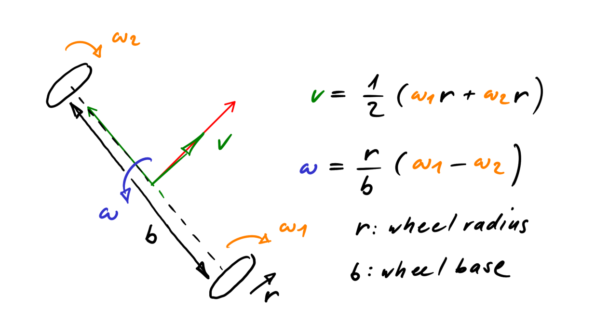

<!-- link list, last updated 16.02.2024 -->
[0]: https://en.wikipedia.org/wiki/Differentiab_wheeled_robot

# Differential Robot Kinematics

The kinematics of a differential drive robot describe the relationship between the robot's wheel speed and the translational and rotational velocity of the robot w.r.t. the robot's body frame. The kinematic model accounts for physical parameters such as wheel radius, wheelbase (distance between the wheels), and the differential drive configuration. The goal of this document is to provide a brief overview of the kinematic model and to provide a simple example of how to calculate the necessary wheel speed of a differential drive robot given the desired translational and rotational velocity of the robot.

## Links

[Wikipedia: Differential Wheeled Robot][0]

## Problem overiew

**Model parameters:**
- Wheel radius $r$
- Wheel base $b$

**Input values:**
- Forward velocity $v$ 
- Rotational velocity with respect to the robot's Z axis $\omega$ 

**Output values:**
- Right wheel velocity $\omega_1$ 
- Left wheel velocity $\omega_2$ 

**NOTE:** 
- For the implementation in C++, we use Eigen. Eigen is a powerfull C++ library for linear algebra.

## Deriving the Kinematic Model

<p align="center">
    
</p>

The computational process should start by defining geometric relationships and begin with simple formulas that will allow us to create transformation matrices from the wheels to the center of the robot, that is, from the rotational wheel speed to the translational and rotational speeds of the robot.

### Linear velocity

The linear speed of the robot can be calculated as the average value of the speed of the right and the left wheel

$$
v = \frac{v_1 + v_2}{2}
$$

The linear speed of a wheel is given by

$$
v_i = \omega_i \cdot r,\ i = 1, 2
$$

There fore, we can write

$$
v = \frac{\omega_1 \cdot r + \omega_2 \cdot r}{2}
$$

and split this into the form

$$
v = \frac{r}{2} \cdot \omega_1 + \frac{r}{2} \cdot \omega_2
$$

### Rotational velocity with respect to robot's Z axis

Assuming that the two wheels are spinning positive in the forward direction of the robot, the rotational speed can be expressed by the following equation

$$
\omega = \frac{v_1 - v_2}{b}
$$

Expressing this in terms of the rotational speed of the wheels, we get

$$
\omega = \frac{\omega_1\cdot r - \omega_2\cdot r}{b}
$$

and split this into the form

$$
v = \frac{r}{b} \cdot \omega_1 - \frac{r}{b} \cdot \omega_2
$$

### Transformation matrix

From the above equations, the transformation matrix can directly be determined. The matrix maps the vector of the wheel speeds to translational and rotational velocity of the robot.

$$
\begin{bmatrix}
v \\\
\omega
\end{bmatrix} =
\begin{bmatrix}
\frac{r}{2} & \frac{r}{2} \\\
\frac{r}{b} & -\frac{r}{b}
\end{bmatrix}
\cdot
\begin{bmatrix}
\omega_1 \\\
\omega_1
\end{bmatrix}
$$

$$
\mathbf{C}_{wheel2robot} =
\begin{bmatrix}
\frac{r}{2} & \frac{r}{2} \\\
\frac{r}{b} & -\frac{r}{b}
\end{bmatrix}
$$

However, our goal is the inverse transformation, that is, from linear and rotational velocity to wheel speeds. By inverting the transformation matrix, we get

$$
\begin{bmatrix}
\omega_1 \\\
\omega_1
\end{bmatrix} = 
\begin{bmatrix}
\frac{1}{r} & \frac{b}{2\cdot r} \\\
\frac{1}{r} & -\frac{b}{2\cdot r}
\end{bmatrix}
\cdot
\begin{bmatrix}
v \\\
\omega
\end{bmatrix}
$$

$$
\mathbf{C}_{robot2wheel} =
\begin{bmatrix}
\frac{1}{r} & \frac{b}{2\cdot r} \\\
\frac{1}{r} & -\frac{b}{2\cdot r}
\end{bmatrix}
$$

## Example Code

As mentioned previously when writing code with the above transformations, the eigen library is used to define vectors and matrices and perform linear algebra. First, define the geometric values of the vehicle, such as wheel radius and wheelbase. In addition, you can write the corresponding matrix and define vectors that will contain the wheel speeds and robot's velocities.

```
// robot kinematics
const float r_wheel = 0.0563f / 2.0f; // wheel radius in meters
const float b_wheel = 0.13f;          // wheelbase, distance from wheel to wheel in meters
Eigen::Matrix2f Cwheel2robot; // transform wheel to robot
Cwheel2robot <<  r_wheel / 2.0f   ,  r_wheel / 2.0f   ,
                 r_wheel / b_wheel, -r_wheel / b_wheel;
Eigen::Vector2f robot_coord = {0.0f, 0.0f};  // contains v and w (robot translational and rotational velocity)
Eigen::Vector2f wheel_speed = {0.0f, 0.0f};  // w1 w2 (wheel speed)
```

To calculate the rotational speeds of the wheels, you must first define the desired values of the linear and rotational speed of the robot, e.g.

```
robot_coord(0) = 1.0f;
robot_coord(1) = 0.5f;
```

**NOTE:** 
- To assign appropriate values to individual elements of the vector we use the convention (0), (1).

Then apply the calculation with the following command:

```
wheel_speed = Cwheel2robot.inverse() * robot_coord;
```

To access the velocity of the wheels just use the appropriate index:

```
// set velocity setpoints in rps
motor_right.setVelocity(wheel_speed(0) / (2.0f * M_PI));
motor_left.setVelocity(wheel_speed(1) / (2.0f * M_PI));
```