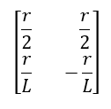
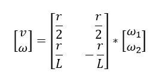
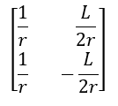
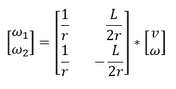

# Differential robot kinematics

The kinematics of a differential drive robot describe the relationship between the robot's motion and the control inputs applied to its wheels. This typically involves equations that relate the linear and angular velocities of the robot to the velocities of its individual wheels. The kinematic model accounts for factors such as wheel radius, wheelbase (distance between the wheels), and the differential drive configuration to accurately predict the robot's trajectory based on the control commands given to its wheels.

## Problem overiew
As mentioned above, the goal is to be able to get the right trajectory for the robot's movement. Our goal is to properly calculate the velocity values of the motors that drive the left and right wheels to get the desired motion. The input data in this case are:
- Wheel radius $\displaystyle r $
- Wheel base $\displaystyle L $
- Linear velocity $\displaystyle v $ 
- Rotational velocity with respect to robot's Z axis $\displaystyle \omega$ 

The output values in this case are:
- right_wheel_velocity (rotational) $\displaystyle \omega_1$ 
- left_wheel_velocity (rotational) $\displaystyle \omega_2$ 

**NOTE:** 
- For these calculations, we'll leverage the Eigen library, renowned for its ability to define matrices and vectors, streamlining the computation process.
- All the calculations should be done in **SI** units.
## Math
<center></center>

The computational process should start by defining geometric relationships and begin with simple formulas that will allow us to create transformation matrices from the wheels to the center of the robot, that is, from their wheel speeds to linear and rotational speeds. Important in this process is to define which direction of rotation of the robot is positive and which is negative.

### Linear velocity
The linear speed of the robot is calculated as the average value of the speed of the right and left wheels.

$\displaystyle v = \frac{v_1 + v_2}{2} $

The linear speed of a wheel is equal to the product of the rotational speed and the radius of the wheel.

$\displaystyle v_1 = \omega_1 * r  $

Therefore, we can write down:

$\displaystyle v = \frac{\omega_1 * r + \omega_2 * r}{2} $

We break this into two fractions:

$\displaystyle v = \frac{\omega_1 * r}{2} + \frac{\omega_2 * r}{2} $

### Rotational velocity with respect to robot's Z axis
Assuming that the two wheels are spinning in the same direction one at a time with different speeds, and with the direction of rotation thus assumed to be positive, the rotational speed is expressed by the following equation.

$\displaystyle \omega = \frac{v_1}{\frac{L}{2}} - \frac{v_2}{\frac{L}{2}} $

Converting this to rotational speeds, we get:

$\displaystyle \omega = \frac{\omega_1 * r - \omega_2 * r}{L} $

We break this into two fractions:

$\displaystyle v = \frac{\omega_1 * r}{L} + \frac{\omega_2 * r}{L} $

### Transformation matrix

From the above equations, a transformation matrix can be determined that allows linear and rotational speed to be determined from the speed of the wheels.
<!-- TODO solve the problems with pictures - matrixies -->

<center></center>

<!-- \begin{bmatrix}
\frac{r}{2} & \frac{r}{2} \\
\frac{r}{L} & -\frac{r}{L} \\
\end{bmatrix} -->

Therefore, to calculate linear and rotational speed, you need to multiply the transformation matrix and the wheel speed matrix. 

<center></center>

<!-- \begin{bmatrix}
\ v \\
\ \omega \\
\end{bmatrix}
\ =
\begin{bmatrix}
\frac{r}{2} & \frac{r}{2} \\
\frac{r}{L} & -\frac{r}{L} \\
\end{bmatrix}
\ *
\begin{bmatrix}
\ \omega_1 \\
\ \omega_1 \\
\end{bmatrix} -->

However, our goal is usually the reverse calculation, that is, from linear and rotational speed to wheel speed. In this case, the transformation matrix must be inverted resulting in the following matrix. 

<center></center>

<!-- \begin{bmatrix}
\frac{1}{r} & \frac{L}{2*r} \\
\frac{1}{r} & -\frac{L}{2*r} \\
\end{bmatrix} -->


With this, the calculation of the wheel speed matrix is as follows:

<center></center>
<!-- \begin{bmatrix}
\ \omega_1 \\
\ \omega_1 \\
\end{bmatrix}
\ =
\begin{bmatrix}
\frac{1}{r} & \frac{L}{2*r} \\
\frac{1}{r} & -\frac{L}{2*r} \\
\end{bmatrix}
\ *
\begin{bmatrix}
\ v \\
\ \omega \\
\end{bmatrix} -->


## Coding
As mentioned previously when writing code with the above transformations, the eigen library is used to define vectors and matrices.
First, define the geometric values of the vehicle, such as wheel radius and track width. In addition, you can write the corresponding matrix and define vectors that will contain the wheel speeds and robot's velocities.

```
// Robot kinematics
const float r_wheel = 0.0563f / 2.0f; // wheel radius
const float L_wheel = 0.13f;         // distance from wheel to wheel
Eigen::Matrix2f Cwheel2robot; // transform wheel to robot
Cwheel2robot <<  r_wheel / 2.0f   ,  r_wheel / 2.0f   ,
                    r_wheel / L_wheel, -r_wheel / L_wheel;
Eigen::Vector2f robot_coord;  // contains v and w (robot translational and rotational velocities)
Eigen::Vector2f wheel_speed;  // w1 w2 (wheel speed)
robot_coord.setZero();
wheel_speed.setZero();
```

To calculate the rotational speeds of the wheels, you must first define the values of the linear and rotational speeds of the robot.

```
robot_coord(0) = 1.0f;
robot_coord(1) = 0.5f;
```
**NOTE:** 
- To assign appropriate values to individual elements of the vector we use the simple numbering (0), (1).

Then make the calculation with the following command.

```
wheel_speed = Cwheel2robot.inverse() * robot_coord;
```

To access velocity of wheels just use appropriate number of place in vector

```
motor_right.setVelocity(wheel_speed(0) / (2.0f * M_PI));
motor_left.setVelocity(wheel_speed(1) / (2.0f * M_PI));

```
<!-- 
## Another useful dependencies -->


