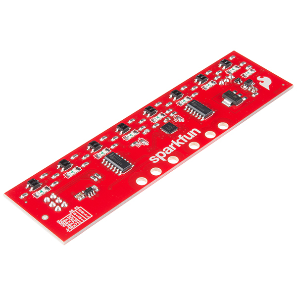
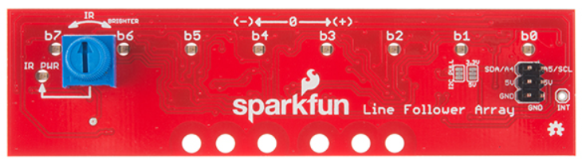
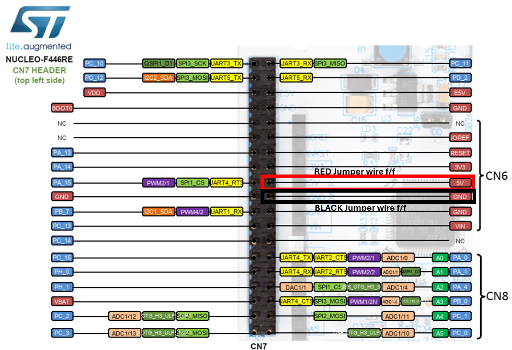
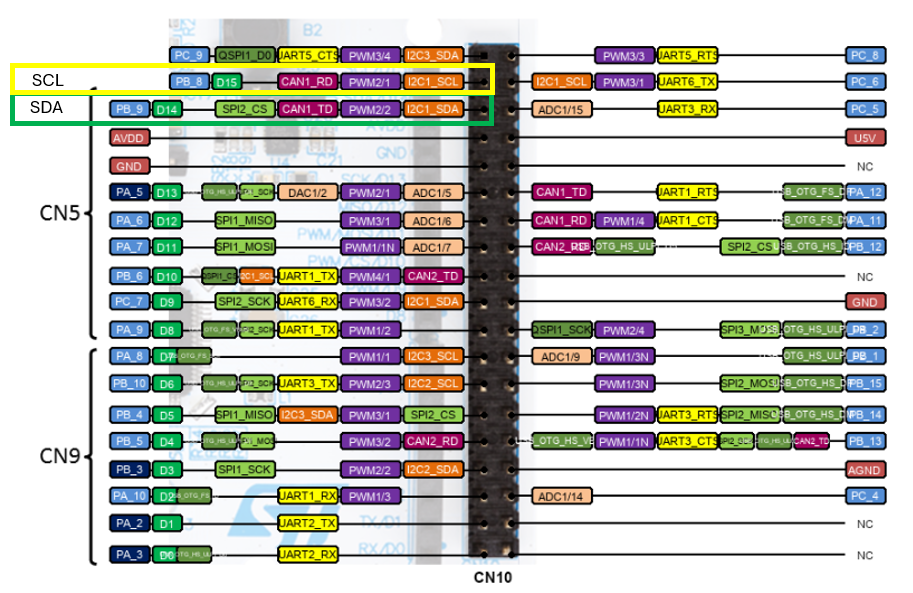

<!-- link list -->
[0]: https://www.sparkfun.com/products/13582
[1]: https://learn.sparkfun.com/tutorials/sparkfun-line-follower-array-hookup-guide
[2]: https://learn.sparkfun.com/tutorials/serial-peripheral-interface-spi/all
[3]: https://os.mbed.com/platforms/ST-Nucleo-F446RE/

# Line Follower Array 

The sensor incorporates eight diodes for line detection, with each diode's illumination indicating the presence of a line beneath it. The IR brightness control and indicator can be adjusted with the on-board potentiometer. The sensor's I2C interface allows for easy integration with the PES Board, and the sensor's low power consumption makes it suitable for battery-powered applications. The sensor's compact size and low weight make it an ideal choice for small robots.

<p align="center">
    
</p>

## Technical Specifications

| | Sparkfun Line follower sensor array |
|-|-|
|Sensor eyes number    | 8           |
|Interface             | I2C         |
|Supply Voltage        | 5 V         |
|Supply Current        | 25 - 185 mA |
|Read Cycle TIme       | 3.2 ms      |

## Links

[Sparkfun Line Follower Sensor Array][0] <br>
[Sparkfun Line Follower Hookup Guide][1]

## Datasheets

[Sparkfun Line Follower Sensor Array](../datasheets/line_follower_array.pdf)

## **WARNING**

<b>Before attempting to connect the sensor, it is crucial to carefully review the section [Connection to the PES Board](../markdown/line_follower.md#connection-to-the-pes-board). This sensor is highly sensitive, and mishandling during the connection process can lead to destruction of the sensor. Therefore, thorough understanding and caution are necessary to avoid damaging the unit!</b>

## Line Follower Driver

The ``LineFollower`` driver is used to calculate wheel speed based on encoder sensor readings and the robot geometry, as well as on other settings declared by the user.

To start using the ``LineFollower`` driver, the initial step in the ***main.cpp*** file is to create the ``LineFollower`` object and specify the pins to which the object will be assigned.

To set up the module in the main function, it's necessary that you define two DC motor objects. To do so, please see the instructions provided in [DC motor](../markdown/dc_motor.md). Code snipets that should be placed in the correct places:

```
#include "pm2_drivers/DCMotor.h"
```

```
// create object to enable power electronics for the DC motors
DigitalOut enable_motors(PB_ENABLE_DCMOTORS);
```

```
const float voltage_max = 12.0f; // maximum voltage of battery packs, adjust this to
                                 // 6.0f V if you only use one battery pack
const float gear_ratio = 78.125f; 
const float kn = 180.0f / 12.0f;
// motor M1 and M2, do NOT enable motion planner, disabled per default
DCMotor motor_M1(PB_PWM_M1, PB_ENC_A_M1, PB_ENC_B_M1, gear_ratio, kn, voltage_max);
DCMotor motor_M2(PB_PWM_M2, PB_ENC_A_M2, PB_ENC_B_M2, gear_ratio, kn, voltage_max);
```

**NOTE:**
- Follow the instructions [Motor M2 Closed-Loop Velocity Control](../markdown/dc_motor.md#motor-m2-closed-loop-velocity-control)
- The control algorithm in the ``LineFollower`` driver works best if the motion planner for the dc motors is disabled.

### Connection to the PES Board

As communication protocol I2C is used. I2C relies on a data pin and a clock pin (more information can be found [here][2]). To power the sensor, a voltage of 5V is required.

In the described robot, the following pins are utilized:
- Data **PB_9**
- Clock **PB_8**

[Nucleo Board pinmap][3]

## **WARNING 2**

<b>As previously emphasized, this sensor is highly sensitive, and improper connections can lead to damage. It's very important to thoroughly examine the provided pictures illustrating the correct way of connecting the sensor to avoid any issues.</b> <br>

<b> Take note of the pin descriptions on the sensor. Connect the red power cable to the pin labeled 5V and the black ground cable to the pin labeled GND.</b>
<p align="center">
    
</p>

To plug the power source you will need to use:

- 2 m/f jumper wires (black and red)
<p align="center">
    
</p>

- 2 f/f jumper wires (black and red)
<p align="center">
    
</p>

- 2 f/f jumper wires (green and yellow)
<p align="center">
    
</p>

### Create Line Follower Object

Initially, it's essential to add the suitable driver to our ***main.cpp*** file and then create an object with the following variables defined (in **SI** units):

- SDA pin - Used for data transfer in I2C standard
- SCL pin - Used for clock synchronization
- d_wheel - Wheel diameter in meters
- L_wheel - Wheelbase, distance from wheel to wheel in meters
- bar_dist - Distance from wheel axis to leds on sensor bar / array
- max_motor_vel_rps - Maximum motor speed given in revolutions per second

The remaining values are defined by default, but there is a possibility to change some of the parameters, as described below the description of the internal algorithm operation.

```
#include "pm2_drivers/LineFollower.h"
```

```
const float d_wheel = 0.0564f; // wheel diameter in meters
const float L_wheel = 0.13f;   // wheelbase, distance from wheel to wheel in meters
const float bar_dist = 0.083f; // distance from wheel axis to leds on sensor bar / array
// line follower driver
LineFollower lineFollower(PB_9, PB_8, bar_dist, d_wheel, L_wheel, motor_M2.getMaxPhysicalVelocity());
```

**NOTE:** 
- The velocity values provided as input are originally expressed in revolutions per second. However, within the driver, these values are converted into radians per second for calculation purposes. Once the calculation is completed in the driver, it is then converted back into revolutions per second. This conversion allows for the use of a unit directly compatible with the DC motor object.

### Parametres Adjustment

The ``LineFollower`` class provides functionality to dynamically adjust the following key parameters:

1. Proportional Gain (Kp) and Non-linear Gain (Kp_nl):
- Function: ``void setRotationalVelocityGain(float Kp, float Kp_nl)``
- Parameters: ``Kp`` and ``Kp_nl``
- Description: These parameters influence the proportional gain and non-linear gain (squared) in the robot's angular velocity control, allowing user to fine-tune the response to deviations from the desired line angle.

2. Maximum Wheel Velocity:
- Function: ``void setMaxWheelVelocity(float max_wheel_vel)``
- Parameter: ``max_wheel_vel``
- Description: This parameter limits the maximum wheel velocity (argument in rotations per second), indirectly affecting the robot's linear and angular velocities. User can adjust this limit to optimize performance for their system (tuning).

### Driver Ussage

The mathematical operations carried out within the driver determine the speed values for each wheel: right and left. These speed values are expressed in revolutions per second (RPS), allowing direct control of the motors using these values. Below is the code that should be executed when the **USER** button is pressed.

```
// visual feedback that the main task is executed, setting this once would actually be enough
led1 = 1;
enable_motors = 1;
motor_M1.setVelocity(lineFollower.getRightWheelVelocity()); // set a desired speed for speed controlled dc motors M1
motor_M2.setVelocity(lineFollower.getLeftWheelVelocity());  // set a desired speed for speed controlled dc motors M2
```

**NOTE:** 
- The ``LineFollower`` class assumes that the right motor is M1 and the left motor is M2 (sitting on the robot and looking forward) and that a positive speed setpoint to the motor M1 and M2 will rotate the robot positively around the z-axis (counter-clockwise seen from above).

Below, you'll find an in-depth manual explaining the inner driver functions. While it's not mandatory to use this manual, familiarizing yourself with the content will certainly help. For enhanced comprehension, it's recommended to refer to the [kinematics](../markdown/kinematics.md) document, which provides explanations of the mathematical operations involved.

### Thread Algorithm Description

The ``followLine()`` function is a thread task method responsible for controlling the robot to follow a line based on sensor readings.

1. Thread Execution: The ``followLine()`` method runs continuously in a thread loop. It waits for a thread flag to be set before executing, indicating that it should perform the task.

2. Sensor Reading: Inside the ``while()`` loop, the method checks if any LEDs on the sensor bar are active. If any LEDs are active, it calculates the average angle of the detected line segments relative to the robot's orientation. This angle is stored in ``m_sensor_bar_avgAngleRad``.

3. Control Calculation:
- The maximum wheel velocity in radians per second (``m_max_wheel_vel_rads``) is calculated based on the maximum wheel velocity (``m_max_wheel_vel``).
- The rotational velocity (``m_robot_coord(1)``) is determined using a control ``ang_cntrl_fcn()`` function, which adjusts the robot's orientation to align it with the detected line.
- The translational velocity (``m_robot_coord(0)``) is determined using another control ``vel_cntrl_fcn()`` function, which calculates the robot's forward velocity based on the rotational velocity and geometric parameters.
- The robot's wheel speeds are calculated using the inverse transformation matrix ``m_Cwheel2robot``.

4. Wheel Velocity Conversion: The calculated wheel speeds are converted from radians per second to revolutions per second (``m_right_wheel_velocity`` and ``m_left_wheel_velocity``).

#### Angular Velocity Controller

The ``ang_cntrl_fcn()`` function is responsible for calculating the angular velocity of the robot based on the detected angle of the line relative to the robot's orientation. This function uses proportional and non-linear control to calculate the velocity based on the measured angle.

1. Input Parameters:
- ``Kp``: Proportional gain parameter for angular control.
- ``Kp_nl``: Non-linear gain parameter for angular control.
- ``angle``: The angle of the detected line relative to the robot's orientation.

2. Calculation:
- If the angle is positive (``angle > 0``), the function calculates the angular velocity (``retval``) using the formula:
    ```
    ang_vel = Kp * angle + Kp_nl * angle * angle
    ```
    This formula applies proportional control (``Kp * angle``) along with a non-linear correction term (``Kp_nl * angle * angle``).
- If the angle is zero or negative (``angle <= 0``), the function calculates the angular velocity (``retval``) using a similar formula but with a negative sign for the non-linear term:
    ```
    ang_vel = Kp * angle - Kp_nl * angle * angle
    ```
3. Output:
- The function returns the calculated angular velocity (``retval``).

#### Linear Velocity Controller

The ``vel_cntrl_fcn()`` function calculates the linear velocity of the robot based on its angular velocity and geometric parameters. The function ensures that one of the robot's wheels always turns at the maximum velocity specified by the user while the other adjusts its speed to maintain the desired angular velocity.

1. Input Parameters:
- ``wheel_speed_max``: Maximum wheel speed in radians per second.
- ``b``: Geometric parameter related to the distance between the wheels .
- ``robot_omega``: Angular velocity of the robot.
- ``Cwheel2robot``: Transformation matrix from wheel to robot coordinates.

2. Calculation:
- If ``robot_omega`` is positive, it assigns the maximum wheel speed to the first wheel and calculates the speed for the second wheel by subtracting ``2 * b * robot_omega`` from the maximum speed.
- If ``robot_omega`` is negative or zero, it assigns the maximum wheel speed to the second wheel and calculates the speed for the first wheel by adding ``2 * b * robot_omega`` to the maximum speed.
- The function then calculates the robot's coordinate velocities by multiplying the transformation matrix ``Cwheel2robot`` by the wheel speeds.
- Finally, it returns the linear velocity of the robot, which corresponds to the velocity along the x-axis in the robot's coordinate system.

3. Output:
- The function returns the calculated linear velocity of the robot.

## Solution

[Line follower](../solutions/line_follower.txt)