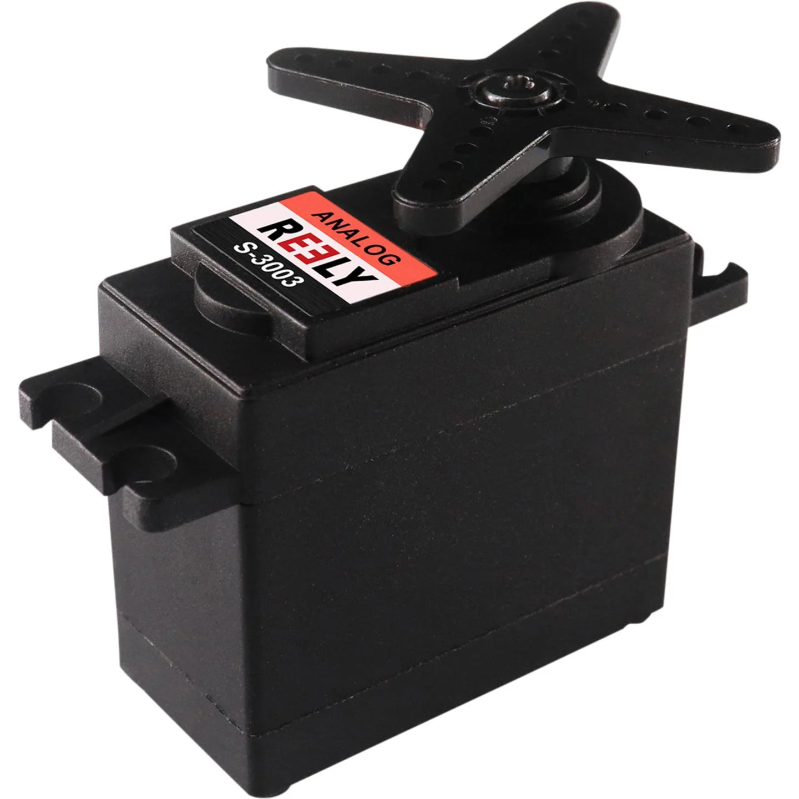
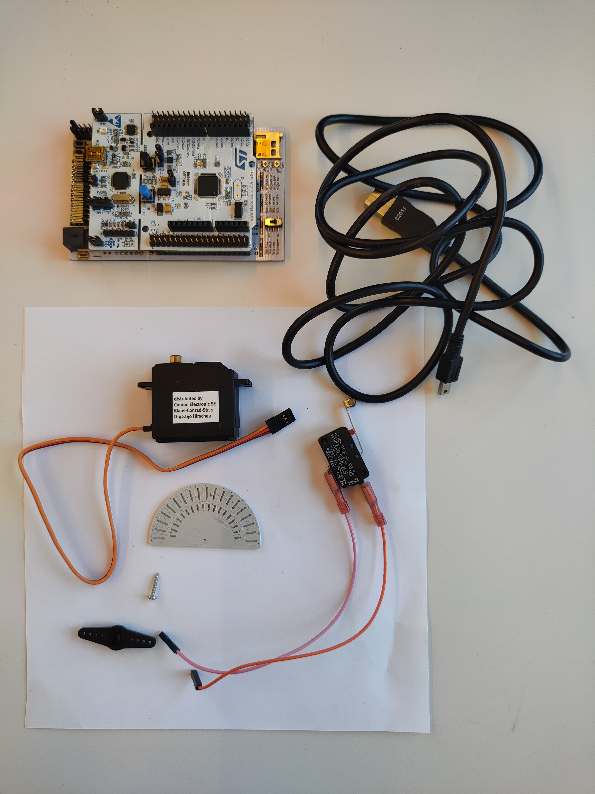
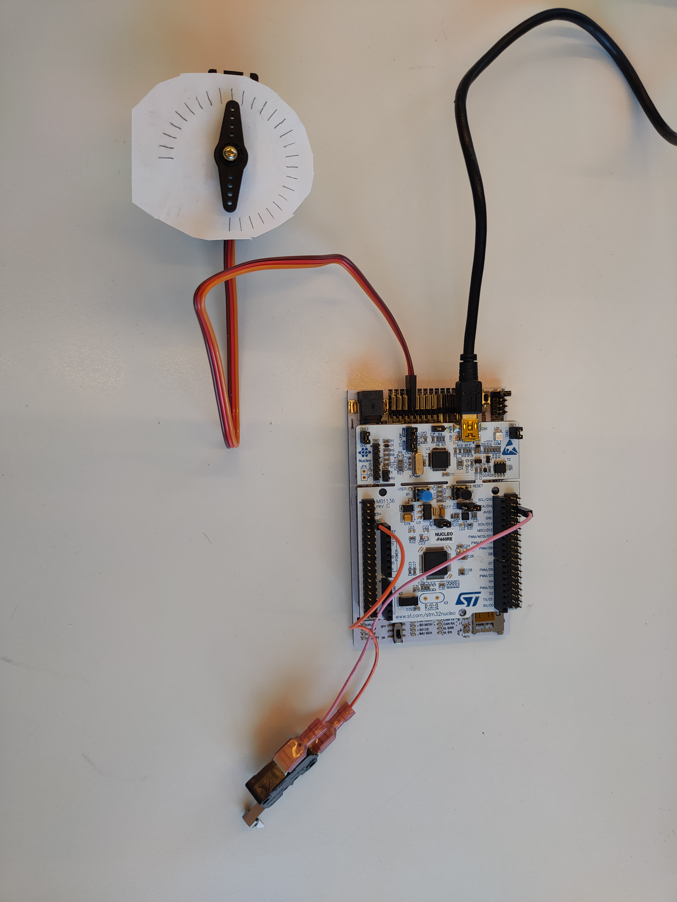

# Analog Servos

A servo is an electrical motor usually designed for precise control over angular or linear position. It typically comprises a motor connected to a sensor for position feedback and a controller that adjusts the motor's movement to match a specified setpoint. Analog Servos function using voltage signals transmitted through pulses width modulation (PWM).

<center></center>
<center> <i>Example of analog servo</i> </center>

## Technical Specifications

| | Futaba S3001 | Reely S-0090 | 
|-|-|-|
|Speed at 60°     | 0.17 / 0.21 s (6.0 / 4.8 V) | 0.14 / 0.12 s (6.0 / 7.0 V)
|Torque           | 0.29 / 0.24 Nm (6.0 / 4.8 V)| 0.88 / 0.98 Nm (6.0 / 7.0 V)
|Operating Voltage| 4.8 - 6.0 V                 | 6.0 - 7.0 V
|Control Frequency| 50 - 70 Hz                  | 50 - 70 Hz
|Weight           | 45.1 g                      | 56 g
|Dimensions       | 40.4 x 19.8 x 36 mm         | 41.0 x 20.0 x 38.0 mm
|Gear             | Plastic                     | Metall

## Links

[Futaba S3001][1]

[Reely S-0090][2]

<!-- link list, last updated 07.12.2023 -->
[1]: https://www.futaba.ch/?cat=21&tit=Servo%20SBus
[2]: https://www.conrad.ch/de/p/reely-standard-servo-cys-s0090-analog-servo-getriebe-material-metall-stecksystem-jr-2203091.html?refresh=true#productHighlights
[3]: https://theorycircuit.com/servo-motor-driver-circuit/
[4]: https://os.mbed.com/platforms/ST-Nucleo-F446RE/

## Datasheets

[Futaba S3001](../datasheets/Futaba_Servo_S3001.pdf)
<!-- TODO TRY TO FIND REELY DATASHEET -->

## Absolut Positioning
Within this system, users have the capability to command and control servo motors in terms of absolute angles or positions. Unlike relative control, where movements are based on the current position, absolute control allows for the specification of exact angular positions. This level of precision facilitates fine-tuned control over the servo's rotational placement, ensuring that it consistently reaches and maintains specific, predetermined angular orientations. This feature proves particularly valuable in applications where precise and absolute positioning is essential for optimal performance.

## Practical Tips

- Keep in mind that every servo requires calibration for proper operation. Calibrated values can differ not only between different servo models but also among individual units of the same model.
- The plug and pin arrangement provides two connection options, but one is incorrect and can result in servo failure. Pay close attention to matching the GND pin with the GND servo wire.
- Operating servos beyond the minimum and maximum values may cause audible stuttering in the device. It's advisable to either disable this behavior or, preferably, calibrate the device accurately.

## Servo driver

The ``servo`` driver is designed for managing servos, commanding the angle within a normalized range of 0 to 1. Internally there is a motion planner running which is used to perform smooth movements.

To start using the ``servo`` driver, the initial step in the ``main`` file is to create the servo object and specify the pins to which the object will be assigned.

### Connection to the PES-board
---------------------------
For the PES-board, analog servos are associated with specific ports, outlined as follows:

```
// PES-Board Pin Names
PB_D0
PB_D1
PB_D2
PB_D3
```
[PES Board pinmap](../datasheets/pes_board_peripherals.pdf)

### Create servo object
---------------------------
In the given example, servos are plugged into pins D0 - D2 on the PES-Board. Initially, it's essential to add the suitable driver to our main file and then create an object with the pin's name passed as an argument.


```
#include "pm2_drivers/Servo.h"

...

Servo servo_D0(PB_D0);
Servo servo_D1(PB_D1);
```

### Calibration
---------------------------
In order to properly control the servo, the basic step that should be performed is its calibration.

<details Closed>
<summary><b>Why calibration?</b></summary>

>Servos operate through PWM (Pulse Width Modulation) signals, enabling the adjustment of the servo motor rotation through varying duty cycle PWM pulses. Initially, the specific pulse width corresponding to a particular servo angle is unknown. Hence, a calibration process is necessary to determine the minimum pulse width for the minimun position and the width associated with the maximum position.
><center></center>
><center> <i>Graphs showing the influence of pulse width on PWM output and on servo position</i> </center>
>
>The charts above illustrate a direct correlation between pulse width and servo position. As the pulse width increases, the servo position changes accordingly. Keep in mind the minimum angle might not be at 0 pulse width. This relationship is further demonstrated in the accompanying illustration below.
><center></center>
><center> <i>Pulse widths and corresponding positions for the example servo</i> </center>
>
>In the example servo illustration, the zero position corresponds to a pulse width of 1 ms, while the maximum yaw angle is achieved at 2 ms. These values are specific to the illustrated servo. Initially, for the servos we intend to use, these values are different. Hence, a calibration process is undertaken to determine these crucial values.
>
>The ultimate aim of calibration is to establish the servo position by assigning values within the range of 0 to 1. Depending on the servo's application, there might not be a need to utilize the entire range of motion; for instance, a 90-degree range could suffice. Through the calibration process, we can determine the pulse width change value corresponding to a 90-degree rotation and assign it to the variables *servo_D0_ang_min* and *servo_D0_ang_max*. Consequently, setting the *servo_value* to this assigned value will result in a 90-degree rotation of our servo.
>
> For more information see: [HERE][3]
</details>

The calibration process involves sending progressively wider pulses to determine, in theory, the pulse width corresponding to the zero position and the width corresponding to the maximum movement of the servo. Best practice is to start with a very small pulse width and gradually increase it until the servo starts moving. This process is repeated until the servo reaches its maximum position. The pulse width values corresponding to the minimum and maximum positions are then recorded. It may be necessary to use a slightly higher minimal value and a slightly lower maximum value to ensure that the servo is working correctly.

After registering these values, sending 0 as a command will move the servo to its minimal angle, while sending 1 will move it to its maximum angle. The servo will not move beyond these values, even if the command is higher than 1.

>Hardware:
> - PES board with NUCLEO-F446RE board
> - Mini USB cable
> - Servo Futaba S3001/RELY S-0090
> - Additional wires to connect the servo to the board
> - Jumper wires
<!-- TODO Add the picture of the set, actual one -->
><center></center>
><center> <i>Hardware used in exercise</i> </center>

#### Procedure

- Initially, define the necessary variables required for the calibration process. Additionally, to monitor the *servo_input* value, it's crucial to include an appropriate printing statement.

```
float servo_input = 0.0f;
int servo_counter = 0; // define servo counter, this is an additional variable
                       // used to command the servo
const int loops_per_seconds = static_cast<int>(ceilf(1.0f / (0.001f * static_cast<float>(main_task_period_ms))));
...

printf("Pulse width: %f \n", servo_input);
```

- To activate the servo, use the following command. Place this command strategically to enable the servo after initiating program execution with the **USER** button.

```
if (!servo_D0.isEnabled())
    servo_D0.enable();
if (!servo_D1.isEnabled())
    servo_D1.enable();
```

- Next, utilize the following function and statements. These will enable the incremental adjustment of the servo position every one second, achieved by modifying the pulse width value. It is crucial to ensure that the incremental change in the servo position, i.e., the pulse width, is very small to obtain precise minimum and maximum values.


```
servo_D0.setNormalisedPulseWidth(servo_input);
servo_D1.setNormalisedPulseWidth(servo_input);
if ((servo_input < 1.0f) &&                     // constrain servo_input to be < 1.0f
    (servo_counter % loops_per_seconds == 0) && // true if servo_counter is a multiple of loops_per_second
    (servo_counter != 0))                       // avoid servo_counter = 0
    servo_input += 0.0025f;
servo_counter++;
```
To reset *servo_input* variable to initial value and disable the servos without restarting the program, add the following command to the else statement, triggered by pressing the **USER** button while program is running.

```
servo_D0.disable();
servo_D1.disable();
servo_input = 0.0f;
```

- In the subsequent step, compile the program. Once compilation is complete, click the **USER** button to initiate the execution. This action prompts the *servo_input* variable value to display on the serial monitor.
- The goal is to monitor the servo_input variable and the servo. Every one second, this variable increases by the specified script value. Record the displayed value on paper after the servo initial movement will take place. Continue monitoring the variable and the servo until increasing the variable no longer results in further rotation of the head. At this point, record the maximum value displayed on the screen.
- Now that the values are known, beneath the servo object declaration, define the appropriate variables with the values obtained in the process.

```
// example values
// servo 0
float servo_D0_ang_min = 0.0150f;
float servo_D0_ang_max = 0.1150f;
// servo 1
float servo_D1_ang_min = ...;
float servo_D1_ang_max = ...;

// calibrate the servos
servo_D0.calibratePulseMinMax(servo_D0_ang_min, servo_D0_ang_max);
servo_D1.calibratePulseMinMax(servo_D1_ang_min, servo_D1_ang_max);
```

- Now the *servo_input* variable will be in a range from 0.0f to 1.0f, which will corespond internally to the pulse width range from value of *servo_D0_ang_min* to value of *servo_D0_ang_max*.

### Command the servo
---------------------------
To use the servo, the initial step is to enable it. This action starts the servo and sets it to the zero position, as this position is defined as the default, but the initial possition can be also passed as argument so that servo with move to the particular position during initialization.

The following statement should be positioned after the trigger statement to avoid running in the background without purpose. The code below employs the **isEnabled** function to check if the servo process is already running. If the **isEnabled** function returns false, the servo process is initialized using the enable function.

```
if (!servo_D0.isEnabled()) {
    servo_D0.enable();
}
```

Utilizing the ``servo`` class involves declaring the position of the servo head within the range of 0 to 1. This is achieved through the use of a function:

```
servo_D2.setNormalisedPulseWidth(servo_input);
```

where *servo_input* is a variable that we can freely change in the right range.

The class design incorporates the capability to execute smooth movements by adjusting the servo's acceleration and initiating gradual deceleration before reaching the target head position. This feature is suitable for activities that demand smooth and steady motions, eliminating abrupt movements. However, there is also an option for rapid motion if a specific requirement necessitates it.

The following function is used for this and should be entered below ``servo`` object declaration:  

```
servo_D0.setMotionProfileAcceleration(0.3f);
```

This function allows for the adjustment of the accelerations during movement by altering its argument. If the argument is omitted, the function defaults to a very large number, resulting in the fastest possible movement. For a smooth motion, you can input any argument greater than 0, bearing in mind that lower parameter values correspond to smaller acceleration values.

<center></center>
<center> <i>Servo movement with maximum acceleration of 0.3f</i> </center>

|<center>Default settings</center>|<center>Acceleration limited</center>|
|-|-|
|<center><i> </i></center> |<center><i>``servo_D0.setMotionProfileAcceleration(0.3f);``</i></center> |
|Without setting the acceleration the servo will move to its commanded position as fast as possible, leading to fast but not very smooth movements.|In scenarios involving set acceleration, the movement becomes smooth, and acceleration values are constrained by the driver. The velocity during the initial stage increases with a constant acceleration and then decreases, maintaining the same acceleration value but with negative sign. This results in a smooth movement. The velocity in- and decreases linearly, for the first increase of the velocity the derivative is approximately 0.1545/(0.95 - 0.435) = 0.3f as set via the class interface.|

<!-- Everything below will be probably erased - I am keeping it to not lose it for now
---------------------------

## Task to do
Before performing the exercise, read the instructions carefully and familiarize yourself with the knitting of each function. Calibrate the servo so that you can operate on the *servo_angle* variable in range 0 to 1.
### Purpose of exercise
The goal is to calibrate the servo with an angular range measurement and then write an appropriate function that will allow the servo to move by a certain value expressed in degrees. To perform the task, it will first be necessary to develop a system that will allow calibration, and then modify the code that will allow the measurement. The next step will be to determine the function describing the dependence of the pulse width on the angular position (Matlab), which will allow us to modify the argument of the function so that we can give the value of the variable *servo_angle* in degrees. List of things needed to do the exercise can be found below:

>Hardware:
> - PES board with NUCLEO-F446RE board
> - Mini USB cable
> - Servo Futaba S3001/RELY S-009
> - Additional wires to connect servo to board
> - Servo arm
> - Sheet of paper
> - Protractor https://www.printables.com/model/8155-printable-protractor?fbclid=IwAR1hko1QIWihh7MkhOoI2Li8rvKICXtOSALfi9kLE6yoYt198Aq4TX69ar0
> - Mechanical button
>
><center></center>
><center> <i>Hardware used in exercise</i> </center>
>
>Software:
> - PM2_Pes_board_example
> - Matlab file: pulse_to_angle_eval.m 

In the main file there are given examples of the minimum and maximum angle pulse width values obtained in the calibration process for a given servo model. <b>However, it should be remembered that these values for each servo, even of the same model, may vary, and to use them for accurate operations, each servo must undergo a calibration process.</b> 

Furthermore, the pulse width values established during the calibration process will be employed to compute the normalized width associated with a specific servo. This enables the servo positions to be adjusted within the range of 0 to 1.


### Conduct of the exercise:
- First of all, you need to prepare the stand by connecting the servo to the PES Board to the appropriate input (D0 - D3). You should also plug the mechanical button into pin **PC_5** (map of pins can be found [HERE][4])
- Prepare a sheet of paper with angles from 0 to 270 degrees drawn on it, then make a hole in the center that will allow you to put it on the servo. Next, put the servo arm on the spline and move the made measurement paper so that the servo arm coincides with the 0-degree indication.
<center></center>
<center> <i>Performing the exercise</i> </center>

- The next step after preparing the hardware is to move on to the software. In this step, we need to write a routine that allows us to make such a movement so that we have enough time to record the measurement. Currently, the routine assumes a 0.1 pulse movement every second. The time to register should be longer. (Hints: you should use **mechanical_button.read()**). Put the routine in the code below.
```
    if (servo_angle < 1.0f & servo_counter % loops_per_seconds == 0 & servo_counter != 0)
    {
        //servo_angle += 0.0025f;
        servo_angle += 0.1f;
    }
    servo_counter++;
```
<details Closed>
<summary>Answear</summary>
<br>

```
    if (servo_angle < 1.0f & servo_counter % loops_per_seconds == 0 & servo_counter != 0  & mechanical_button.read())
    {
        //servo_angle += 0.0025f;
        servo_angle += 0.1f;
    }
    servo_counter++;
```
</details>

- Now you can run the program and write down the pulse width displayed on the screen, and the corresponding angle. 
- Then these data should be entered into the Matlab program ([file](../matlab/pulse_to_angle_eval.m)), running the script will present us with a graphical representation of the data with the best fit function, is it linear? **(I RAN TESTS IT IS LINEAR, INFO FOR ME)**
- Now you need to write modify argument of the function **setNormalisedPulseWidth** so that in the *servo_angle* variable you can declare the angle given in units of angular degrees. (HINT: note that by default the full range is between 0 and 1, our range is between 0 and MAX_ANGLE) 
```
servo_D0.setNormalisedPulseWidth(YOUR EQUATION);
```
<details Closed>
<summary>Answear</summary>
<br>

```
int MAX_ANGLE = "MEASURED ANGLE BY YOU";
servo_D0.setNormalisedPulseWidth(servo_angle/MAX_ANGLE);
```
</details>

- The ultimate goal is to run the program and move the servo arm to a position of 45 degrees. In the end the code should look like this:
```
if (servo_D0.isEnabled() && servo_D1.isEnabled() && servo_D2.isEnabled())
{
    servo_D0.setNormalisedPulseWidth(YOUR EQUATION);
    servo_D1.setNormalisedPulseWidth(YOUR EQUATION);
    servo_D2.setNormalisedPulseWidth(YOUR EQUATION);
                
    if (servo_angle < 1.0f & servo_counter % loops_per_seconds == 0 & servo_counter != 0)
    {
        servo_angle = 45;
    }
    servo_counter++;
}
```
<details Closed>
<summary>Answear</summary>
<br>

```
if (servo_D0.isEnabled() && servo_D1.isEnabled() && servo_D2.isEnabled())
{
    int MAX_ANGLE = "MEASURED ANGLE BY YOU";
    servo_D0.setNormalisedPulseWidth(servo_angle/MAX_ANGLE);
    servo_D1.setNormalisedPulseWidth(servo_angle/MAX_ANGLE);
    servo_D2.setNormalisedPulseWidth(servo_angle/MAX_ANGLE);
                
    if (servo_angle < 1.0f & servo_counter % loops_per_seconds == 0 & servo_counter != 0)
    {
        servo_angle = 45;
    }
    servo_counter++;
}
```
</details> -->