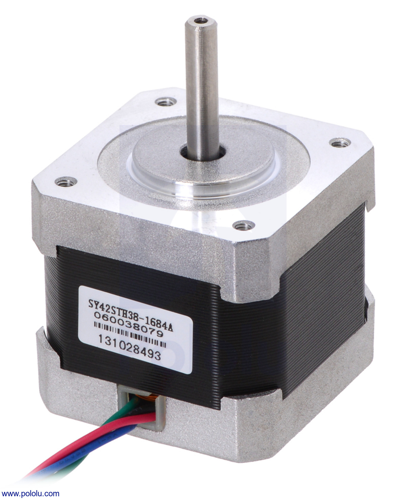
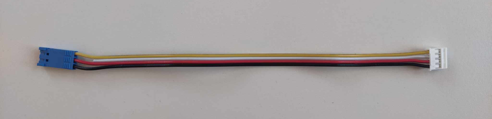

<!-- link list, last updated 03.01.2024 -->
[0]: https://www.pololu.com/product/1209
[1]: https://www.pololu.com/product/2267
[2]: https://www.pololu.com/product/1182

# Stepper motor

A stepper motor is an electromechanical device that converts electrical pulses into precise mechanical movements. Unlike traditional motors, stepper motors move in discrete steps, allowing for accurate control of position and speed without the need for feedback systems. This characteristic makes them ideal for applications requiring precise positioning, such as in robotics, CNC machines, and 3D printers. By energizing the motor windings in a specific sequence, the stepper motor's rotor aligns with the magnetic field, resulting in controlled and incremental rotation. This precise control over movement is why stepper motors are a popular choice in automation and control systems.

<p align="center">
     </br>
    <i>Stepper motor</i>
</p>

## Specifications
Below fit the specifications of the stepper motor and the external driver that operates it:

| Parameter           | NEMA 14  |NEMA 17    |
| ------------------- | ---------|-----------|
| Polarity            | Bipolar  | Bipolar   |
| Size                | 35x36 mm | 42.3x38 mm|
| Current rating      | 1000 mA  | 1680 mA   |
| Voltage rating      | 2.7 V    | 2.8 V     |
| Steps per revolution| 200      | 200       |    
| Resistance          | 2.7 Ohm  | 1.65 Ohm  |
| Number of leads     | 4        | 4         |

A4988 Stepper Motor Driver Carrier

| Parameter                   | Value                     |
| --------------------------- | ------------------------- |
| Minimum operating voltage   | 8 V                       |
| Maximum operating voltage   | 35 V                      |
| Continous current per phase | 1 A                       |
| Maximum current per phase   | 2 A                       |
| Minimum logic voltage       | 3 V                       |
| Maximum logic voltage       | 5.5 V                     |
| Microstep resolutions       | full, 1/2, 1/4, 1/8, 1/16 |

**NOTE:**
- The measurements showed a relatively high variation above 2 meters, there for the measurment range is limited to 2 meters (with the current driver implementation).

## Links

[NEMA 14][0] </br>
[NEMA 17][1] </br>
[A4988 Stepper Motor Driver Carrier][2]

## Datasheets

[A4988 Stepper Motor Driver Carrier](../datasheets/A4988.pdf)

## Practical Tips


## Stepper Motor Example

The `Stepper` class driver controls a stepper motor. It initializes with specified step and direction pins and step-per-revolution settings. The class provides methods to retrieve the current step count, rotation, and velocity of the motor. It also includes methods to set the motor's velocity, absolute and relative rotation, and the number of steps. Additionally, the driver manages motor stepping, threading, and timing through its internal methods and variables.

To start working with the motors, it is necessary to plug it correclty and create an object in the ***main.cpp*** file and assign proper pins, in following example there will be two motors in use.

### Connection to the Nucleo Board


[PES Board pinmap](../datasheets/pes_board_peripherals.pdf)

To establish the connection, utilize the cable displayed in the following image, as it is compatible with the plug and socket on the sensor, and with pins on the PES Board. When connecting the sensor to the PES Board, remember that the yellow wire carries the bidirectional signal. So, make sure to align the blue plug with the PES Board accordingly to ensure a proper connection.

<p align="center">
     </br>
    <i>Cable used to connect to the sensor</i>
</p>

### Create UltrasonicSensor Object

In the given example, the sensor is plugged into pin **D3** on the PES Board. Initially, it's essential to add the suitable driver to the ***main.cpp*** file and then create an `` UltrasonicSensor`` object inside ``main()`` function with the pin's name passed as an argument along with the variable definition that will handle the reading from sensor.

```
#include "pm2_drivers/UltrasonicSensor.h"
```

```
// ultra sonic sensor
UltrasonicSensor us_sensor(PB_D3);
float us_distance_cm = 0.0f;
```

<!-- Additional information is greyed out -->
>Details about the driver
>
>By sending a signal to the sensor, we command it to send a pulse with a rising edge followed by a falling edge and a pulse width of 10 microseconds. The device will emit sound with 8 periods of 40 kHz frequency and try to detect the echo (via convolution or similar). The sensor will then send a pulse proportional to the measurment time, which will be detected by the microcontroller. The time between the rising and falling edge is measured and used to calculate the distance on the microcontroller. This process is repeated every 12000 microseconds.

### Read the Distance

The operation is straightforward since all processes are encapsulated within the class, yielding a completed function that returns the distance in centimeters. This functionality is accessed through the following command:

```
// read us sensor distance, only valid measurements will update us_distance_cm
us_distance_cm = us_sensor.read();
```

If no new valid measurement is available, the ``read()`` function returns -1.0f. This needs to be handeled appropriately in the application, as an example:

```
// read us sensor distance, only valid measurements will update us_distance_cm
const float us_distance_cm_candidate = us_sensor.read();
if (us_distance_cm_candidate > 0.0f) {
    us_distance_cm = us_distance_cm_candidate;
}
```

**NOTE:**
- Do not readout the sensor faster than every 12000 microseconds, otherwise the sensor will report -1.0f frequently.
- For highly accurate measurements, every sensor unit should be calibrated individually. This depends on the specifications of the task you use the sensor for.

