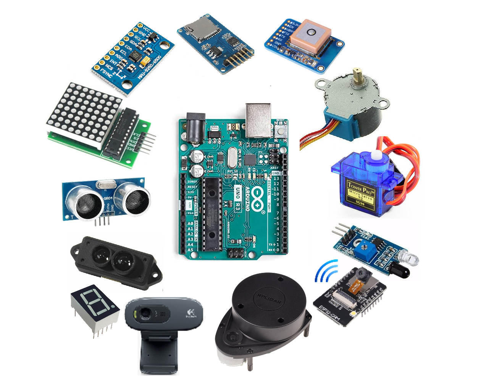

# Tips

Here you'll discover valuable guidance on project creation, development, programming, and writing code for operating a robot or a similar mechatronic system.

## Project development

Here, you'll find guidance on the initial steps in project creation and its subsequent development.

### 1. Brainstorming
--------------------
This stage holds significant importance, particularly in group collaboration, as it encourages the exchange and mutual influence of initial ideas. No specific tools are needed; simply grab a blank sheet or use a whiteboard for ample space. Express your ideas visually or verbally in paragraphs. For projects centered on mechatronic systems, consider essential elements like:
- <b>Think about the main purpose</b> - define the device's purpose, functionalities, and prioritize factors such as speed or accuracy. These considerations guide the direction for formulating specific solutions in the project.
- <b>Think about pitfalls</b> - in the early stages, identifying pitfalls might be challenging, but leveraging your imagination allows you to swiftly eliminate potential paths that may pose challenges or setbacks.

<center></center>

- <b>Evaluate actuators</b> - once you've outlined initial design sketches and established the tasks for your system, the next step involves determining the most suitable components for task execution. While general knowledge of these elements is crucial, it's equally important to factor in the available hardware capabilities and assess which elements of the mechanisms can be feasibly constructed.
- <b>Evaluate sensors</b> - When considering actuators, a crucial step is determining the sensors to pair with them. Sensors play a vital role in providing comprehensive control over the system's operation, offering both safety features to prevent accidents and enhancing the precision of the device's functionality.

### 2. Flow-Chart
-----------------
Creating a flowchart at the project's outset offers crucial benefits. It provides a visual roadmap, aiding in understanding the project's structure and fostering collaboration within the team. The flowchart serves as an early detection tool for potential bottlenecks or complexities, allowing for strategic problem-solving. Detailed planning during flowchart creation minimizes oversights and unexpected issues during execution. The flowchart acts as a reference guide, ensuring ongoing alignment with project objectives. Prior to coding, having a comprehensive flowchart allows for the existence of the entire logic. The programmer can systematically implement the flowchart and its underlying logic, breaking down the process into individual steps that can be implemented and tested separately. This approach facilitates the gradual evolution of the software, ensuring a structured and efficient execution of the robot's operations. More about creating good flow-chart can be found in further part [here](#1-flow-chart)

### 3. Coding
-------------
-  <b>Have no Fear </b>- Start programming as soon as possible. Even if you don't have a clear idea of what you are doing DO IT! You will learn a lot and gain experience that will be useful in the future.
- <b>Just play</b> - Start small, play with your system, maker errors, learn from them, and have fun!
- <b>Step by Step Implementation</b> - Start implementing the ideas you have gathered. With an idea of what actuators and sensors you want to use, as well as how your robot is supposed to work - start writing code gradually. Familiarize yourself with the capabilities of the elements you are using and think about their application to your project. 
- <b>Test</b> - Test what you have written. Testing after each step is implemented is very important due to the fact that only doing so will protect you from larger errors, which will be very difficult to detect in a long block of code.
- <b>Debug</b> - When encountering issues in your code, embrace debugging as a crucial problem-solving tool. It entails identifying and resolving errors, ensuring your program functions seamlessly.After detecting each error and before making each change, think about the solution and then make changes, and go back to the previous point!

Some useful programming tips can be found [here](#programming-tips).

### 4. Prototyping
------------------
Through (fast) prototyping, you not only validate the feasibility of your design but also uncover potential challenges early on. Identifying and addressing issues during the prototyping phase mitigates risks, streamlines the development process, and contributes to the overall success of the project. To achieve this goal, incorporating 3D printing in the preliminary stages of part design proves beneficial. It offers crucial insights, enables the testing of solutions challenging to assess without a physical model, and, importantly, avoids potential time-consuming adjustments to parameters that may not yield effective results in the end. Regularly test and iterate on your prototypes, leveraging the insights gained to ensure a robust and well-optimized final solution.
<center></center>

## Programming tips

Here are essential programming tips to consider during the coding process:

#### 1. Code Readability

- Write clean and readable code. Use meaningful variable and function names to enhance code understanding.
- Follow a consistent coding style, adhering to common conventions like indentation and bracket placement.

```
// bad example
int x; // distance in cm

// good example: with proper naming you can sometimes even leave out comments
int distance_in_cm;
```

#### 2. Comments

- Include comments to explain complex logic, especially if it might not be immediately evident to others (or even yourself) when revisiting the code.
- Don't over-comment simple and obvious code, but strike a balance for clarity.

```
// bad example: unnecessary comment
int result = a + b;  // add a and b

// good example: no comment needed
int result = a + b;
```

#### 3. Avoid Magic Numbers

- Refrain from using "magic numbers" (hard-coded constants) in your code. Define constants with meaningful names instead.
- Constants enhance code readability and make it easier to update values later.

```
const int MAX_ATTEMPTS = 3;
for (int i = 0; i < MAX_ATTEMPTS; ++i) {
    // ...
}
```

#### 4. Modularization

- Break down your code into smaller, modular functions or classes. Each function should ideally perform a single, well-defined task.
- Encapsulation helps manage complexity and makes debugging and testing more manageable.

```
// bad example
int main() {
    // monolithic code
    // ...
}

// good example
void processInput() {
    // function for processing input
    // ...
}

int main() {
    // main function orchestrating the program
    processInput();
    // ...
}
```

#### 5. Printf Debugging

- Use *printf* to print the values of variables during debugging. This provides insights into the state of the program at different points.
- Enhance readability by formatting the debugging output. Include informative labels or context to quickly identify the purpose of the printed values.

```
int value = 42;
printf("Debugging: %d", value);
```

#### 6. Use ChatGPT, GitHub Copilot and similar tools

- First and foremost, don't trust any AI. Always check the answer and the code before using it. Never the less, these tools can be very helpful. And often point you in the right direction. But in the end, you have to understand the code you are writing.
- Utilize ChatGPT for interactive assistance during programming. Describe issues, ask questions, or seek guidance on code-related problems to receive helpful suggestions.
- Leverage ChatGPT to explore algorithms, design patterns, or coding concepts. Describe your requirements, and ChatGPT can provide insights, code snippets, or explanations to enhance your understanding.


## Structuring a Robot-Task

Structuring robot tasks during the design of the software for robots and mechatronic systems is a crucial aspect to ensure efficient and organized operation. This involves breaking down the overall robot functionality into modular and manageable tasks, each addressing specific aspects of the robot's mission. By defining clear interfaces between these tasks, developers can facilitate collaboration and enable the integration of various subsystems. This approach enhances code maintainability, promotes code reuse, and allows for easier debugging and troubleshooting. A vital tool in programming for achieving a well-structured system is the design of a state machine.

### 1. Flow chart
------------------------
To create a state machine the first step is to design a flow chart diagram. A well-designed flow chart is crucial for this task as it provides a visual roadmap for developers. It helps in understanding the logic, identifying potential pitfalls, and ensuring that all possible scenarios are considered. A clear and comprehensive flow chart acts as a guide during the actual coding process, making the implementation of the state machine more efficient and less error-prone. Here are the steps you can follow:
- <b>Identify States and Transitions</b> - Clearly define the states your robot can be in and the transitions between them. States represent distinct phases of operation.
- <b>Define Inputs and Outputs</b> - Identify the inputs (sensors, commands) and outputs (actuators, responses) relevant to each state. This helps in understanding how the robot interacts with its environment.
- <b>Specify Conditions</b> - Determine the conditions that trigger state transitions. These conditions often depend on sensor readings, user inputs, or specific events. Whenever possible try to stay away from time-based decisions! Try to use sensor input instead.
- <b>Sketch Transitions</b> - Draw arrows to represent transitions between states. Label each arrow with the condition that triggers the transition. This visualizes the logical flow of the system.
- <b>Detail Actions</b> - Include details of actions or operations performed in each state. This can involve activating motors, reading sensors, or making decisions based on inputs.
- <b>Consider Error Handling</b> - Integrate error or exception states in the flow chart to address unexpected conditions. Define how the robot should behave in the presence of errors.
- <b>Iterate and Refine</b> - Review and refine the flow chart iteratively. Ensure that the logical flow is coherent, and states and transitions align with the desired robot behavior.


Below you can find an example of a flow chart of a mechatronic system that is designed in workshop 2.

<center></center>

### 2. State machine
------------------------
A state machine represents different states a robot can be in and the transitions between these states based on certain conditions or events. To create a state machine, follow these steps:
- <b>Identify States and Events</b> - Enumerate the distinct states your robot can be in (e.g., idle, moving, obstacle detected). Identify events or conditions that trigger transitions between states (e.g., button press, sensor input). <b>FLOW-CHART IS REALLY HELPFUL HERE!</b>
- <b>Define State Transitions</b> - For each state, specify the conditions that lead to transitions to other states. Determine the actions or functions associated with each transition.
- <b>Syntax in C++</b> - Use an enum or a set of constants to represent different states.
Implement a switch-case structure to handle state transitions based on conditions.
Execute corresponding actions or functions for each state. Example:
- <b>Be aware</b> - When changing states, prioritize sensor input for effective transitions, avoiding code blocks or time-based decisions that may lead to blocking code. In general, blocking code should be avoided! 

Here is the code used to implement the state machine based on the preceding flowchart. Analyze the code to compare how the steps correspond between the flowchart and the code implementation.
```
// set up states for state machine
enum RobotState {
    INITIAL,
    EXECUTION,
    SLEEP,
    EMERGENCY
} robot_state = RobotState::INITIAL;

...

// state machine
switch (robot_state) {
    case RobotState::INITIAL: {
        // enable the servo
        if (!servo_D0.isEnabled())
            servo_D0.enable();
        robot_state = RobotState::EXECUTION;

        break;
    }
    case RobotState::EXECUTION: {
        // function to map the distance to the servo movement
        //function to command servo

        // if the measurement is outside the min and max range go to SLEEP
        if ((us_distance_cm < us_distance_min) || (us_distance_cm > us_distance_max)) {
            robot_state = RobotState::SLEEP;
        }
        if (mechanical_button.read()) {
            robot_state = RobotState::EMERGENCY;
        }

        break;
    }
    case RobotState::SLEEP: {
        // if the measurement is within the min and max range go to EXECUTION
        if ((us_distance_cm > us_distance_min) && (us_distance_cm < us_distance_max)) {
            robot_state = RobotState::EXECUTION;
        }
        if (mechanical_button.read()) {
            robot_state = RobotState::EMERGENCY;
        }

        break;
    }
    case RobotState::EMERGENCY: {
        // The transition to the emergency state actually causes
        // the execution of the commands contained in the else statement,
        // that is, it disables the servo and resets the values read from the sensors.
        toggle_do_execute_main_fcn();

        break;
    }
    default:

        break; // do nothing
}
```