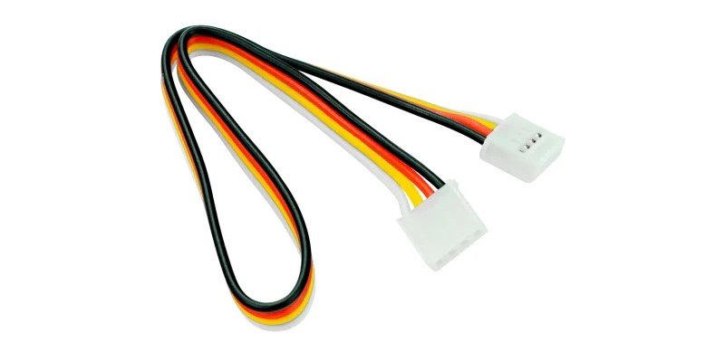

# Ultrasonic Sensor

An ultrasonic sensor (range finder / detector) is a type of sensor designed to measure the relative distance between the device and an object that reflects sound waves. This sensor operates by emitting ultrasonic pulses and measuring the time it takes for these pulses to bounce back as echoes. By knowing the speed of sound in air, it is possible to calculate the relative distance to the object based on the time elapsed between the emission of the ultrasonic pulse and the reception of its echo.

<center>
    
</center>
<center>
    <i>Grove-Ultrasonic Ranger V2.0</i>
</center>

## Specifications

| Parameter           | Value           |
| ------------------- | --------------- |
| Operating voltage   | 3.2 ~ 5.2 V     |
| Measuring range     | 3 - ~200 cm     |
| Size                | 50 x 25 x 16 mm |
| Weight              | 13 g            |
| Measurment angle    | 15 °            |
| Working temperature | -10 ~ 60 °C     |

<!-- |Operating current    | 8 mA            | -->
<!-- |Ultrasonic frequency | 40 kHz          | -->
<!-- |Measuring range      | 2 - 350 cm      | -->
<!-- |Resolution           | 1 cm            | -->
<!-- |Output               | PWM             | -->
<!-- |Trigger signal       | 10 uS TTL       | -->
<!-- |Echo signal          | TTL             |  -->


**NOTE:**

- The measurements showed a relatively high variation above 2 meters, there for the measurment range is limited to 2 meters (with the current driver implementation).

## Links

[DigiKey][0]

[seeed studio][1]

<!-- last updated 03.01.2024 -->
[0]: https://www.digikey.ch/de/products/detail/seeed-technology-co-ltd/101020010/5482600?s=N4IgTCBcDaIOICUDyA1AogAgKoBkAqCAggMpIByAkgMIZFlxoIYpgB0ADCALoC%2BQA
[1]: https://wiki.seeedstudio.com/Grove-Ultrasonic_Ranger/

## Datasheets

[Grove-Ultrasonic Ranger V2.0](../datasheets/Grove-Ultrasonic_Ranger_WiKi.pdf)

## Practical Tips

- Do not hot plug the Grove-Ultrasonic Ranger, otherwise it will damage the sensor. The measured area must be no less than 0.5 square meters and smooth.
- Before using the sensor for responsible tasks, make sure that the measurements that are read by the sensor are correct and sufficiently accurate (this might need calibration).

## Ultrasonic Sensor Example

The ``UltrasonicSensor`` class provides functionality to measure distances by emitting ultrasonic pulses 
and measuring the time taken for the echo to return. It encapsulates the details of interfacing with the
sensor hardware and offers a simple interface for obtaining distance measurements in centimeters.
Maximum measurment distance is approximately 2 meters (measured 198.1 cm) with a mearuement period of 12000
microseconds. If no new valid measurement is available, the read() function returns -1.0f.

To start working with the sensor, it is necessary to plug it correclty and create an object in the ``main`` file and assign a digital output.

### Connection to the PES-Board
---------------------------
The ultrasonic sensor was tested with a 5V power supply and a single pin that transmits the signal. There for, it can use the same ports as the servos. You can use the the following pins:

```
PB_D0
PB_D1
PB_D2
PB_D3
```

[PES Board pinmap](../datasheets/pes_board_peripherals.pdf)

To establish the connection, utilize the cable displayed in the following iamge, as it is compatible with the plug and socket on the sensor. Connect a regular jumper wire to the shown cable and use them for linking to the PES Board. The sensor's pins are labeled, but the plug design ensures a single correct connection: the bidirectional signal is transmitted through the yellow wire.

<center></center>
<center> <i>Cable used to connect to the sensor</i> </center>

### Create UltrasonicSensor Object
---------------------------
In the given example, the sensor is plugged into pin D3 on the PES-Board. Initially, it's essential to add the suitable driver to the ``main.cpp`` file and then create an object with the pin's name passed as an argument along with the variable definition that will handle the reading from sensor.

```
#include "pm2_drivers/UltrasonicSensor.h"
```

```
// ultra sonic sensor
UltrasonicSensor us_sensor(PB_D3);
float us_distance_cm = 0.0f;
```

<!-- Additional information is greyed out -->
>Details about the driver
>
>By sending a signal to the sensor, we command it to send a pulse with a rising edge followed by a falling edge and a pulse width of 10 microseconds. The device will emit sound with 8 periods of 40 kHz frequency and try to detect the echo (via convolution or similar). The sensor will then send a pulse proportional to the measurment time, which will be detected by the microcontroller. The time between the rising and falling edge is measured and used to calculate the distance on the microcontroller. This process is repeated every 12000 microseconds.

### Read the Distance
---------------------------
The operation is straightforward since all processes are encapsulated within the class, yielding a completed function that returns the distance in centimeters. This functionality is accessed through the following command:

```
// read us sensor distance, only valid measurements will update us_distance_cm
us_distance_cm = us_sensor.read();
```

or simply

```
// read us sensor distance, only valid measurements will update us_distance_cm
us_distance_cm = us_sensor;
```

If no new valid measurement is available, the read() function returns -1.0f. This needs to be handeled appropriately in the application, as an example:

```
// read us sensor distance, only valid measurements will update us_distance_cm
const float us_distance_cm_candidate = us_sensor.read();
if (us_distance_cm_candidate > 0.0f) {
    us_distance_cm = us_distance_cm_candidate;
}
```

**NOTE:**

- Do not readout the sensor faster than every 12000 microseconds, otherwise the sensor will report -1.0f frequently.
- For highly accurate measurements, every sensor unit should be calibrated individually. This depends on the specifications of the task you use the sensor for.

