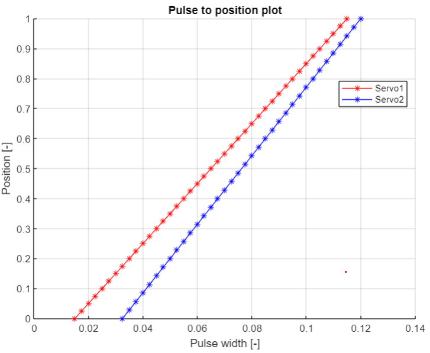

# Workshop 2

## Scope of Workshop 2

The objective of the second workshop is to enhance comprehension of the PES board's hardware and functionality by incorporating additional sensors and actuators, specifically a servo. Furthermore, participants will be introduced to new tools/programming concepts, including a state machine, which is crucial for developing reliable software for the robot. 

## Hardware

>Part 1:
> - PES board with NUCLEO-F446RE board
> - Mini USB cable
> - Servo Futaba S3001/RELY S-0090
> - Additional wires to connect the servo to the board
> - Jumper wires

>Part 2:
> - PES board with NUCLEO-F446RE board
> - Mini USB cable
> - Ultrasonic sensor 
> - Mechanical button
> - Servo Futaba S3001/REELY S-0090
> - Additional wires to connect the sensor to the NUCLEO board
> - Jumper wires

## Assignment

We assume that you know the general structure of the PES board, if not, please visit: [PES board](../../README.md#pes-board)

### Part 1
------------------
The first task will be the integration of two servo motors and their calibration.

1. Refer to the Servo manual for a step-by-step guide on the calibration process. You can find there information about connecting the servos to the board Follow the instructions outlined in the manual to complete the calibration.

    > [Servo tutorial](../markdown/servo.md)

### Part 2
------------------
The second task will be to design a state machine, where we will use additionaly an ultrasonic sensor. Here a state machine will be created, with the four following states:

**0. Initial**   </br>
**1. Execution** </br>
**2. Sleep**     </br>
**3. Emergency** </br>

The overall goal is to build a mechatronic system capable of adjusting the deflection of the servo lever based on the distance measured by the sensor. The system will enter a sleep state if readings are out of range, and pressing the mechanical button will trigger an emergency state/stop.

Before doing the task you should look at [structuring a robot task tutorial](../markdown/tips.md#structuring-a-robot-task).

Below you can find the flow chart showing the logic of the transitions to each state.
<center></center>
<center> <i>Flow chart</i> </center>

1. Connect the mechanical button to the PC_5 pin on the Nucleo board (see [Nucleo Board pinmap][1])
2. In the ``main`` function, it's essential to create a mechanical button object with the appropriate pullup mode:
```
// mechanical button
DigitalIn mechanical_button(PC_5); // create DigitalIn object to evaluate mechanical button, you
                                   // need to specify the mode for proper usage, see below
mechanical_button.mode(PullUp);    // sets pullup between pin and 3.3 V, so that there
                                   // is a defined potential
```
3. Read the US sensor manual and create object in the ``main`` function
    >[US sensor](../markdown/ultrasonic_sensor.md)
4. Make sure that you added statement to handle non-valid measurment below distance reading command e.g.:
```
if (us_distance_cm < 0.0f) {
    us_distance_cm = 0.0f;
}
```
4. At the beginning  ``main`` function create robot states:
```
enum RobotState {
    INITIAL,      
    EXECUTION,
    SLEEP,
    EMERGENCY
} robot_state = RobotState::INITIAL;

```
5. Then in the while loop after triggering the statement (do execute main task), place the blank template of state machnie:

```
switch (robot_state) {
    case RobotState::INITIAL:

        break;
    case RobotState::EXECUTION:

        break;
    case RobotState::SLEEP:

        break;
    case RobotState::EMERGENCY:

        break;
    default:
        break;
}
```

6. Move the enabling statements to the initial state case. Add function specifying new robot states - execution.

```
case RobotState::INITIAL: {
    // enable the servo
    if (!servo_D0.isEnabled())
        servo_D0.enable();
    robot_state = RobotState::EXECUTION;
    break;
}
```

7. In the following step, you should create a routine that translates the measured distance into the tilting of the servo mechanism. Since servos are calibrated, the objective is to map the servo in a way that associates the minimum sensor range with zero servo deflection and the maximum range with the maximum servo deflection. After defining the sensor, input the minimum and maximum range, considering a smaller range within the measurement range if needed:

```
float us_distance_min = 4.0f;
float us_distance_max = 50.0f;
```

8. Enter the function that will map the distance measurments to servo the deflation along with the servo commanding statement:

```
case RobotState::EXECUTION: {
    // function to map the distance to the servo movement
    float servo_input = (1 / (us_distance_max - us_distance_min)) * us_distance_cm - (us_distance_min / (us_distance_max - us_distance_min));
    servo_D0.setNormalisedPulseWidth(servo_input);

    break;
}
```

9. Now, let's establish the conditions that prompt transitions to other states. As previously mentioned, pressing the mechanical button will trigger the initiation of the sleep state, while the emergency state will be initialized when the sensor readout falls below the minimum range. Within the execution state:

```
case RobotState::EXECUTION: {
    // function to map the distance to the servo movement
    float servo_input = (1 / (us_distance_max - us_distance_min)) * us_distance_cm - (us_distance_min / (us_distance_max - us_distance_min));
    servo_D0.setNormalisedPulseWidth(servo_input);

    // if the measurement is outside the min and max range go to SLEEP
    if ((us_distance_cm < us_distance_min) || (us_distance_cm > us_distance_max)) {
        robot_state = RobotState::SLEEP;
    }
    if (mechanical_button.read()) {
        robot_state = RobotState::EMERGENCY;
    }

    break;
}
```

10. The serial terminal window will display the message "SLEEP MODE". To transition back from the sleep state to execution, the sensor readings must fall within the specified range. Further more, the emergency switch can also be activated in the sleep state. Within the sleep state place:

```
case RobotState::SLEEP: {
    // if the measurement is within the min and max range go to EXECUTION
    if ((us_distance_cm > us_distance_min) && (us_distance_cm < us_distance_max)) {
        robot_state = RobotState::EXECUTION;
    }
    if (mechanical_button.read()) {
        robot_state = RobotState::EMERGENCY;
    }

    break;
}
```

11. The emergency state sets all output values to 0 and disables hardware that requires activation, simulating an emergency stop for the machine. To reactivate the mechatronic system, press the **RESET** button. Inside the emergency state:

```
case RobotState::EMERGENCY: {
    toggle_do_execute_main_fcn();

    break;
}
```
12. The rest of the code that is placed in this statement can be erased. There should be also following command to print out US sensor distance placed inside while loop.
```
printf("US sensor distance %f \n", us_distance_cm);
```
13. Include the following command in the else statement, triggered by pressing the USER button while the program is running, to reset the variables to their initial values without restarting the program.
```
// reset variables and objects
servo_D0.disable();
us_distance_cm = 0.0f;
```
14. Upload the program to the microcontroller using the **PLAY** button in Mbed studio and then point the sensor at an object that is at a distance that is within the range specified in the code and click the **USER** button.

15.  Experiment by directing the sensor towards an object that is out of range. Press the mechanical button and observe the serial terminal for the outcome.

16.  After finishing tasks unplug Nucleo board from computer.

## Summary

In the second workshop, the integration of a servo along with the PES board, servo calibration, and mechanical button incorporation were emphasized. Additionally, the creation of a state machine using an ultrasonic sensor was explored. By establishing robot states and implementing transition conditions, a mechatronic system capable of adjusting a servo lever based on sensor readings was achieved. This workshop delivered hands-on experience in hardware integration and state machine design.

Questions for own consideration:
- How can you create a state machine without using the syntax demonstrated in the exercise?

## Solution

[Workshop 2, Part 1](../solutions/main_ws2_p1.txt)

[Workshop 2, Part 2](../solutions/main_ws2_p2.txt)

<center></center>
<center> <i>Pulse width to position graph</i> </center>

<center></center>
<center> <i>Flow chart for workshop 2</i> </center>

<!-- Links -->
[1]: https://os.mbed.com/platforms/ST-Nucleo-F446RE/
