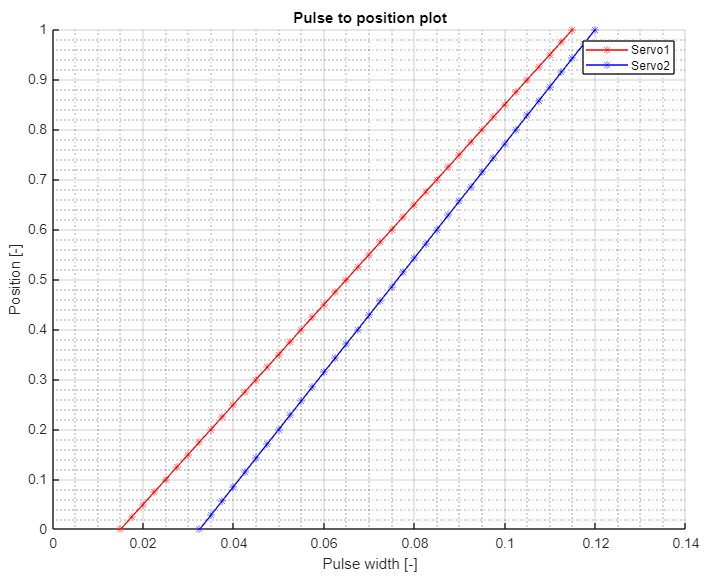

<!-- link list -->
[0]: https://os.mbed.com/platforms/ST-Nucleo-F446RE/

# Workshop 2

The objective of the second workshop is to get familiar with the PES board's hardware and functionality by incorporating additional sensors and actuators, specifically an ultrasonic distance sensor and a servo motor.

Furthermore, participants will be introduced to new tools/programming concepts, including a state machine, which is advantageous for developing reliable and maintanable firmware for the robot. 

## Hardware

>Part 1:
> - PES board with NUCLEO-F446RE board
> - Mini USB cable
> - Servo Futaba S3001/RELY S-0090
> - Additional wires to connect the servo to the PES Board
> - Jumper wires

>Part 2:
> - PES Board with NUCLEO-F446RE board
> - Mini USB cable
> - Ultrasonic sensor 
> - Mechanical button
> - Servo Futaba S3001/REELY S-0090
> - Additional wires to connect the sensor to the NUCLEO board
> - Jumper wires

### Assignment

We assume that you know the general structure of the PES Board, if not, please visit: [PES board](../../README.md#pes-board)

## Part 1

The first task will be the integration of two servo motors and the corresponding calibration process.

1. Refer to the Servo manual for a step-by-step hardware tutorial on the usage of a servo motor and on the calibration process. There you can find also information about how to connect the servos to the PES Board. Follow the instructions outlined in the haradware tutorial to complete the calibration.

    > [Servo Tutorial](../markdown/servo.md)

## Part 2

The second task will be to design and implement a state machine (this is nothing else than a switch-case statement as a logic part). Here we will use an additional ultrasonic sensor. A state machine with the following states will be used:

>**0. Initial**   </br>
>**1. Execution** </br>
>**2. Sleep**     </br>
>**3. Emergency** </br>

The overall goal is to build a mechatronic system capable of adjusting the deflection of the servo based on the distance measured by the ultrasonic sensor. The system will enter a sleep state if readings are not within a specified range, and pressing the mechanical button will trigger an emergency state/stop which will reset the system.

Before beginning the task you should make yourself familiar with [Structuring a Robot Task Tutorial](../markdown/tips.md#structuring-a-robot-task)

Below you can find a flow chart diagram showing the logic of the transitions for each state.

<p align="center">
     </br>
    <i>Flow chart</i>
</p>

1. Connect the mechanical button to the **PC_5** pin on the Nucleo board (see [Nucleo Board Pinmap][0]). And add the ultrasonic distance sensor driver ``UltrasonicSensor.h`` to the top of the ***main.cpp*** file:

```
#include "pm2_drivers/UltrasonicSensor.h"
```

2. In the scope of the ``main()`` function, you have to create a ``mechanical_button`` object and set the appropriate pullup mode:

```
// mechanical button
DigitalIn mechanical_button(PC_5); // create DigitalIn object to evaluate mechanical button, you
                                   // need to specify the mode for proper usage, see below
mechanical_button.mode(PullUp);    // sets pullup between pin and 3.3 V, so that there
                                   // is a defined potential
```

3. Read the ultrasonic sensor manual and create an object in the ``main()`` function
    >[Ultrasonic Sensor Manual](../markdown/ultrasonic_sensor.md)
4. Make sure that you add a reading command and statement to handle non-valid measurment. This should be placed inside ``while()`` loop within ``if()`` statement, to be executed after clicking **USER** button:

```
// read us sensor distance, only valid measurements will update us_distance_cm
const float us_distance_cm_candidate = us_sensor.read();
if (us_distance_cm_candidate > 0.0f) {
    us_distance_cm = us_distance_cm_candidate;
}
```

5. At the top of ``main()`` function create the ``robot_state`` enum object:

```
// set up states for state machine
enum RobotState {
    INITIAL,
    EXECUTION,
    SLEEP,
    EMERGENCY
} robot_state = RobotState::INITIAL;
```

6. In the ``while()`` loop, after setting the variable ``do_execute_main_task``, place the blank template of the state machine:

```
// state machine
switch (robot_state) {
    case RobotState::INITIAL:
        printf("INITIAL\n");

        break;
    case RobotState::EXECUTION:
        printf("EXECUTION\n");

        break;
    case RobotState::SLEEP:
        printf("SLEEP\n");

        break;
    case RobotState::EMERGENCY:
        printf("EMERGENCY\n");

        break;
    default:
        break;
}
```

7. Enable the servo in the **INITIAL** state and transition to the **EXECUTION** state:

```
    case RobotState::INITIAL:
        printf("INITIAL\n");
        // enable the servo
        if (!servo_D0.isEnabled())
            servo_D0.enable();
        robot_state = RobotState::EXECUTION;

        break;
```

8. In the following step, you will map the measured distance to the deflection of the servo. Since the servos are calibrated, the objective is to map the servo in a way that associates variable ot the minimum sensor range ``us_distance_min`` with zero servo deflection and the maximum range ``us_distance_max`` with the maximum servo deflection. Define the following variables along with the variable ``us_distance_cm``:

```
// min and max ultra sonic sensor reading, (us_distance_min, us_distance_max) -> (servo_min, servo_max)
float us_distance_min = 6.0f;
float us_distance_max = 40.0f;
```

9. Implement the following code snippet and discuss it:

```
    case RobotState::EXECUTION:
        printf("EXECUTION\n");
        // function to map the distance to the servo movement (us_distance_min, us_distance_max) -> (0.0f, 1.0f)
        servo_input = (us_distance_cm - us_distance_min) / (us_distance_max - us_distance_min);
        // values smaller than 0.0f or bigger than 1.0f ar constrained to the range (0.0f, 1.0f) in setNormalisedPulseWidth
        servo_D0.setNormalisedPulseWidth(servo_input);

        break;
```

10. Now, let's establish the conditions that prompt transitions to other states. As previously mentioned, pressing the mechanical button will trigger the initiation of the **SLEEP** state, while the **EMERGENCY** state will be initialized when the sensor reading is outside the above defined min and max range. Use the following code snippet:

```
    case RobotState::EXECUTION:
        printf("EXECUTION\n");
        // function to map the distance to the servo movement (us_distance_min, us_distance_max) -> (0.0f, 1.0f)
        servo_input = (us_distance_cm - us_distance_min) / (us_distance_max - us_distance_min);
        // values smaller than 0.0f or bigger than 1.0f ar constrained to the range (0.0f, 1.0f) in setNormalisedPulseWidth
        servo_D0.setNormalisedPulseWidth(servo_input);

        // if the measurement is outside the min or max limit go to SLEEP
        if ((us_distance_cm < us_distance_min) || (us_distance_cm > us_distance_max)) {
            robot_state = RobotState::SLEEP;
        }

        // if the mechanical button is pressed go to EMERGENCY
        if (mechanical_button.read()) {
            robot_state = RobotState::EMERGENCY;
        }

        break;
```

11. To transition back from the **SLEEP** state to the **EXECUTION** state, the sensor readings must fall within the specified range. And important to note, the **EMERGENCY** state needs also to be triggerable when the system is in the **SLEEP** state. Add the following code snippet to the **SLEEP** state case condition:

```
    case RobotState::SLEEP:
        printf("SLEEP\n");
        // if the measurement is within the min and max limits go to EXECUTION
        if ((us_distance_cm > us_distance_min) && (us_distance_cm < us_distance_max)) {
            robot_state = RobotState::EXECUTION;
        }

        // if the mechanical button is pressed go to EMERGENCY
        if (mechanical_button.read()) {
            robot_state = RobotState::EMERGENCY;
        }

        break;
```

12. The **EMERGENCY** state resets all output variables to zero and disables the hardware that requires activation (for now only the servo), simulating an emergency stop of the system. To reactivate the system, press the **USER** button. At the **EMERGENCY** condition insert:

```
    case RobotState::EMERGENCY:
        printf("EMERGENCY\n");
        // the transition to the emergency state causes the execution of the commands contained
        // in the outer else statement scope, and since do_reset_all_once is true the system undergoes a reset
        toggle_do_execute_main_fcn();

        break;
```

And add the following command to the ``else()`` statement at the end of the ``while()`` loop:

```
// the following code block gets executed only once
if (do_reset_all_once) {
    do_reset_all_once = false;

    // reset variables and objects
    led1 = 0;
    servo_D0.disable();
    us_distance_cm = 0.0f;
    robot_state = RobotState::INITIAL;
}
```

13. You can print the measured distance with the following command:

```
printf("US sensor distance %f \n", us_distance_cm);
```

14. Compile and flash the program to the microcontroller using the **PLAY** button in Mbed studio and then point the sensor at an object that is at a distance that is within the range specified in the code and click the **USER** button.

15. Experiment by directing the sensor towards an object that is out of range. Press the mechanical button and observe the serial terminal to see the current state and the measured distance (if valid and within the specified range).

## Summary

In the second workshop, the integration of a servo along with the PES board, servo calibration, and a mechanical button incorporation were performed. Additionally, the creation of a state machine using an ultrasonic sensor was explored. By establishing robot states and implementing transition conditions, a primitive mechatronic system capable of adjusting a servo based on ultrasonic sensor readings was achieved.

## Important Notes

- Identing matters! It is important to keep the code clean and readable. This will help you and others to understand the code better.
- Printing to the serial terminal is a useful tool for debugging. It is important to understand the state of the system and the values of the variables at different points in the code. This will help you to identify errors and to understand the system better. But you have to be carefull with the amount of printed data, as it can slow down the system. So after debugging, it is important to remove or comment out the print statements.

## Solutions

- [Workshop 2, Part 1](../solutions/main_ws2_p1.cpp)
- [Workshop 2, Part 2](../solutions/main_ws2_p2.cpp)

<p align="center">
     </br>
    <i>Pulse width to normalised position for both servos </i>
</p>