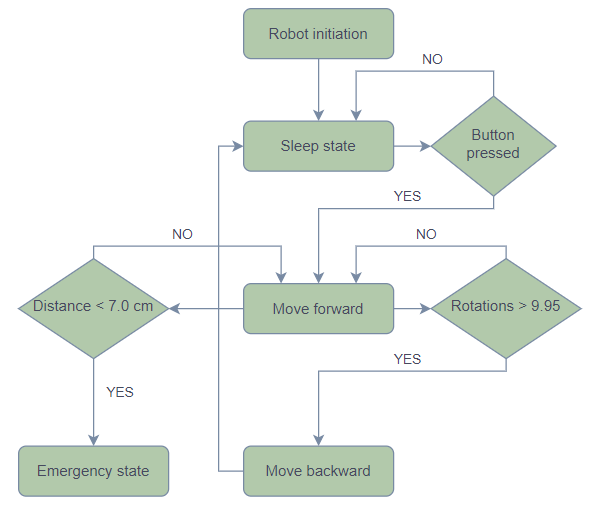

<!-- link list -->
[0]: https://os.mbed.com/platforms/ST-Nucleo-F446RE/

# Workshop 3

In the third workshop, we will be using DC motors, exploring various control methods and understanding how to use the capabilities of the available drivers and hardware. DC motors are often used as drive systems, e.g. to drive a small vehicle or robot forward.

We will discuss different control strategies for motor control, e.g. speed controlled and position controller (angular speed and rotation). Additionally, we will revisit the construction of a state machine, incorporating sensor-equipped motors for distance measurement and integrating a mechanical button into the system.

## Hardware

>Part 1:
> - PES Board with NUCLEO-F446RE board
> - Mini USB cable
> - DC motor
> - Jumper wires

>Part 2:
> - PES Board with NUCLEO-F446RE board
> - Mini USB cable
> - Ultrasonic sensor 
> - Mechanical button
> - DC motor
> - Additional wires to connect the sensor to the NUCLEO board
> - Jumper wires

### Assignment

## Part 1

In the first task, we will focus just on understanding the motor functionality and control mechanisms. To achieve this, we'll rely on the information provided in the hardware tutorial: [DC Motor Tutorial](../markdown/dc_motor.md)

**Important Note: In this tutorial, the motors are consistently connected to the same pin. However, it's worth noting that there is an option to connect them to different pins: M2 and M3. You can run up to 3 DC motors with one PES Board.**

## Part 2

In the second part, we'll design a state machine using the hardware introduced in the previous workshop. The state machine will consist of five states:

>**0. Initial**   <br>
>**1. Sleep**     <br>
>**2. Forward**   <br>
>**3. Backward**  <br>
>**4. Emergency** <br>

The objective is to set up a mechatronic system that mimics a can crusher press. Pressing the mechanical button will prompt to the **Forward** state in which the motor will move forward a specific number of revolutions (representing the press going down), and then, after reaching a specyfic number of rotation, move backwards to the initial position and then to the **Sleep** state. If the distance from the ultrasonic sensor while being in the **Forward** state below a certain threshold (limit) (e.g. an obstacle is in the way), the device should switch to the **Emergency** state and rapidly return to the initial position and shut down.

Before doing the task you may look at the [Structuring a Robot Task Tutorial](../markdown/tips.md#structuring-a-robot-task).

1. Create the flow-chart diagram according to the description above.
   
2. Connect the mechanical button to pin **PC_5** and and ground to the corresponding pin (see [Nucleo Board Pinmap][0])
   
3. Define a ``mechanical button`` object in the ``main()`` function with the appropriate pullup mode

```
// mechanical button
DigitalIn mechanical_button(PC_5); // create DigitalIn object to evaluate mechanical button, you
                                   // need to specify the mode for proper usage, see below
mechanical_button.mode(PullUp);    // sets pullup between pin and 3.3 V, so that there
                                   // is a defined potential
```

4. Connect the ultrasonic sensor to pin **D3** on the PES Board (see [PES Board Pinmap](../datasheets/pes_board_peripherals.pdf))

5. Include the necessary drivers at the top of the ***main.cpp*** file. For more details refer to [Ultrasonic Distance Sernsor](../markdown/ultrasonic_sensor.md)

```
#include "pm2_drivers/UltrasonicSensor.h"

...

// ultra sonic sensor
UltrasonicSensor us_sensor(PB_D3);
float us_distance_cm = 0.0f;
```

6. Within the ``while()`` loop, include the following command to enable distance readings from the sensor regardless of the robot's current state.

```
// read us sensor distance, only valid measurements will update us_distance_cm
const float us_distance_cm_candidate = us_sensor.read();
if (us_distance_cm_candidate > 0.0f) {
    us_distance_cm = us_distance_cm_candidate;
}
```

7. Create an object for [Motor M3](../markdown/dc_motor.md#motor-m3), which will be controlled by setting the setpoint position. Activate the motion planner and configure the maximum acceleration to half of the default value.

```
const float voltage_max = 12.0f; // maximum voltage of battery packs, adjust this to
                                    // 6.0f V if you only use one battery pack

// motor M3
const float gear_ratio_M3 = 78.125f; // gear ratio
const float kn_M3 = 180.0f / 12.0f;  // motor constant [rpm/V]
// it is assumed that only one motor is available, there fore
// we use the pins from M1, so you can leave it connected to M1
DCMotor motor_M3(PB_PWM_M1, PB_ENC_A_M1, PB_ENC_B_M1, gear_ratio_M3, kn_M3, voltage_max);
// enable the motion planner for smooth movement
motor_M3.enableMotionPlanner(true);
// limit max. acceleration to half of the default acceleration
motor_M3.setMaxAcceleration(motor_M3.getMaxAcceleration() * 0.5f);
```

8. At the start of the ``main()`` function, include the enumerators representing different robot states:

```
// set up states for state machine
enum RobotState {
    INITIAL,
    SLEEP,
    FORWARD,
    BACKWARD,
    EMERGENCY
} robot_state = RobotState::INITIAL;
```

9. Then in the ``if()`` statement triggering through ``do_execute_main_task``, place a blank template of the state machine:

```
// state machine
switch (robot_state) {
    case RobotState::INITIAL:

        break;

    case RobotState::SLEEP:

        break;

    case RobotState::FORWARD:

        break;

    case RobotState::BACKWARD:

        break;

    case RobotState::EMERGENCY:

        break;

    default:

        break;
}
```

10. Insert the DC motor enable statement in the initial state case. Subsequently, go the the next state, which is the **SLEEP** state

```
    case RobotState::INITIAL:
        // enable hardwaredriver dc motors: 0 -> disabled, 1 -> enabled
        enable_motors = 1; // setting this once would actually be enough
        robot_state = RobotState::SLEEP;

        break;
```

11. The **SLEEP** state is the state in which system will wait for the signal to execute the task, so to go to the **FORWARD**, this signal will be provided by clicking the mechanical button.

```
    case RobotState::SLEEP:
        // wait for the signal from the user, so to run the process 
        // that is triggered by clicking mechanical button
        // then go the the FORWARD state
        if (mechanical_button.read()) {
            robot_state = RobotState::FORWARD;
        }

        break;
```

1.   In the **FORWARD** state, include a command to execute 2.9f forward rotations and a condition that transitions to the **BACKWARD** after reaching 2.85f revolutions. Also, add a condition that, if the distance measured by the ultrasonic sensor is less than 4.5f cm, the system will enter the **EMERGENCY** state.

```
    case RobotState::FORWARD:
        // press is moving forward until it reaches 2.9f rotations, 
        // when reaching the value go to BACKWARD
        motor_M3.setRotation(2.9f); // setting this once would actually be enough
        // if the distance from the sensor is less than 4.5f cm,
        // we transition to the EMERGENCY state
        if (us_distance_cm < 4.5f) {
            robot_state = RobotState::EMERGENCY;
        }
        // switching condition is sligthly smaller for robustness
        if (motor_M3.getRotation() > 2.89f) {
            robot_state = RobotState::BACKWARD;
        }

        break;
```

13.  In the **BACKWARD** state, the device returns to the initial position. Additionally, include a statement to transition to the **SLEEP** state after reaching that position.

```
    case RobotState::BACKWARD:
        // move backwards to the initial position
        // and go to the SLEEP state if reached
        motor_M3.setRotation(0.0f);
        // switching condition is sligthly bigger for robustness
        if (motor_M3.getRotation() < 0.01f) {
            robot_state = RobotState::SLEEP;
        }

        break;
```

14.  In the **EMERGENCY** state, the machine needs to quickly return to the initial position and turn off. To achieve this, disable the motion planner, as it allows for the fastest possible movement. Subsequently, turn off the machine, simulating the effect of pressing the emergency button. To reuse the mechatronic system, reset the machine using the **RESET** button. Inside the **EMERGENCY** state:

```
    case RobotState::EMERGENCY:
        // disable the motion planer and
        // move to the initial position asap
        // then reset the system
        motor_M3.enableMotionPlanner(false);
        motor_M3.setRotation(0.0f);
        if (motor_M3.getRotation() < 0.01f) {
            toggle_do_execute_main_fcn();
        }

        break;
```

15.  In the end of the ``while()`` loop, add the following command to print the distance measured by the sensor and the number of rotations of the motor.

```
// print to the serial terminal
printf("US Sensor in cm: %f, DC Motor Rotations: %f\n", us_distance_cm, motor_M3.getRotation());
```

16. Include the following commands in the ``else()`` statement, triggered by pressing the **USER** button while the program is running, to reset the variables to their initial values without restarting the program.

```
// reset variables and objects
led1 = 0;
enable_motors = 0;
us_distance_cm = 0.0f;
motor_M3.enableMotionPlanner(true);
robot_state = RobotState::INITIAL;
```

17. Upload the program to the microcontroller using the **PLAY** button in Mbed Studio. Then, aim the sensor at an object that is beyond the distance triggering the **EMERGENCY** state. Press the **USER** button, and click the mechanical button.
    
18. Experiment by pressing the mechanical button and pointing the sensor at an object that is below the threshold specified in the code.

## Summary

In the third workshop, we explored DC motors and the functionality of the drivers. In the first part, we focused on understanding the motor functionality and the different ways to control it. In the second part, we designed a state machine that incorporated the mechanical button and ultrasonic sensor. The state machine mimicked a can crusher press, moving the motor forward and backward, and transitioning to the **EMERGENCY** state if an obstacle was detected.

## Solutions

- [Workshop 3, Part 1](../solutions/main_ws3_p1.cpp)
- [Workshop 3, Part 2](../solutions/main_ws3_p2.cpp)

<p align="center">
     </br>
    <i>Flow Chart for Workshop 3</i>
</p>