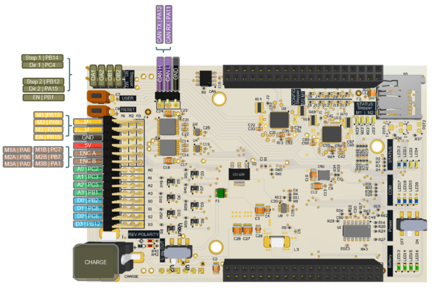
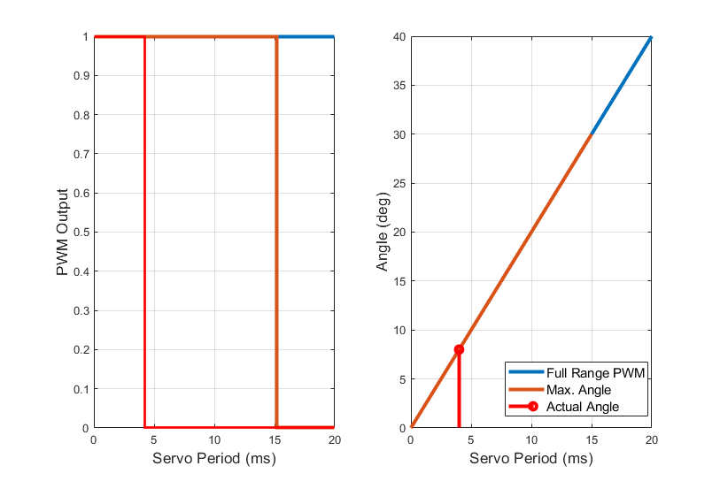
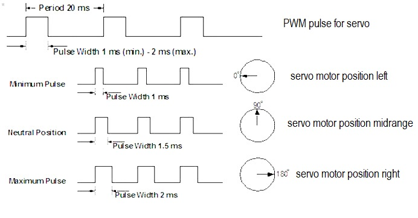

# Analog Servos

## Technical Specifications

| | Futaba S3001 | Reely S-0090 | 
|-|-|-|
|Speed at 60°     | 0.17 / 0.21 s (6.0 / 4.8 V) | 0.14 / 0.12 s (6.0 / 7.0 V)
|Torque           | 3.0 / 2.4 kgcm (6.0 / 4.8 V)| 88 / 98 Ncm (6.0 / 7.0 V)
|Operating Voltage| 4.8 - 6.0 V                 | 6.0 - 7.0 V
|Control Frequency| 50 - 70 Hz                  | 50 - 70 Hz
|Weight           | 45.1 g                      | 56 g
|Dimensions       | 40.4 x 19.8 x 36 mm         | 41.0 x 20.0 x 38.0 mm
|Gear             | Plastic                     | Metall

* Using the servos outside der min and max value cal lead to audible stottering of the device. You can either
disable it or better: calibrate the device properly.

## Links

[Futaba S3001][1]

[Reely S-0090][2]

<!-- link list, last updated 14.11.2023 -->
[1]: https://www.futaba.ch/?cat=21&tit=Servo%20SBus
[2]: https://www.conrad.ch/de/p/reely-standard-servo-cys-s0090-analog-servo-getriebe-material-metall-stecksystem-jr-2203091.html?refresh=true#productHighlights
[3]: <https://theorycircuit.com/servo-motor-driver-circuit/>

## Servo driver
Servo driver is made to control the analog servos by setting the position from range 0 to 1. It also has the ability to control the speed of movement so that so-called "smooth movements" can be made.
### Fisrt steps
First step to use the servo driver is to create in the main file the servo object and define the pins that will be assigned to the object. Analog servos are assigned to PES board pins D0 to D3.
```
// PES-Board Pin Names 
#define PES_BOARD_D0 PB_2
#define PES_BOARD_D1 PC_8
#define PES_BOARD_D2 PC_6
#define PES_BOARD_D3 PB_12
```
<center></center>
<center> <i>PES board pin map</i> </center>


If the servo  that you want to work on is connected to pin D0, enter **PES_BOARD_D0** as the argument of the created object.
```
// create Servo objects to command servos
Servo servo_D0(PES_BOARD_D0);
Servo servo_D1(PES_BOARD_D1);
Servo servo_D2(PES_BOARD_D2);
```
In order to properly control the servo, the basic step that should be performed is its calibration.

> For what we need calibration?
>
> Servos are controled by PWM (Pulse Width Modulation) output signal, which allows to set servo motor ratiation and position by using differnt duty cycle PWM pulse. By default we do not know the pulse width corresponding to a specific servo position. Therefore, we need to perform a calibration process to find the minimum pulse width corresponding to position 0 (minimum) and the width assigned to the maximum position. 
><center></center>
><center> <i>Graphs showing the influence of pulse width on PWM output and on servo position</i> </center>
>
>The charts above show that pulse has a direct effect on position. If the pulse width is increased, the position of the servo changes. This is also shown in the illustration below.
><center></center>
><center> <i>Pulse widths and corresponding positions for the example servo</i> </center>
>
>As the illustration of the example servo shows, the zero position of the servo occurs at a pulse width of 1 ms, and the maximum yaw angle is obtained at 2ms. Initially, we do not know these values for the servos we want to operate, so we perform a calibration process to learn them. 
>
> For more information see: [HERE][3]

In the main file there are given examples of the minimum and maximum angle pulse width values obtained in the calibration process for a given servo model. <b>However, it should be remembered that these values for each servo, even of the same model, may vary, and to use them for accurate operations, each servo must undergo a calibration process.</b> 

In addition, the pulse width values determined in the calibration process will be used to calculate the normalized width corresponding to a given servo so that the servo positions can be countermanded from 0 to 1. 

>How can it be useful? 
>
>The indirect goal of calibration is to be able to define the servo position by setting values from 0 to 1. Depending on the application of our servo we do not always want to use the full range of motion sometimes it is enough for us to have a range of 90 degrees. During the calibration process we can measure what value of the pulse width change corresponds to 90 degrees and then assign it to the corresponding variables *servo_D0_ang_min* and *servo_D0_ang_max*. Thanks to this, assigning the value servo_value will make our servo rotate 90 degrees.


### Calibration procedure
The calibration procedure assumes that you have a servo with unknown pulse width values for the minimum and maximum angles. In order to carry out this process, the following steps must be followed:

- In the main file, the function that takes into account calibrated pulses must be commented out: 
```
//servo_D0.calibratePulseMinMax(servo_D0_ang_min, servo_D0_ang_max);
//servo_D1.calibratePulseMinMax(servo_D1_ang_min, servo_D1_ang_max);
//servo_D2.calibratePulseMinMax(servo_D2_ang_min, servo_D2_ang_max);
```
- Further down in the main file is a function that allows the servo position to be changed incrementally by a set value every one second:
```
    servo_D2.setNormalisedPulseWidth(servo_angle);
    if (servo_angle < 1.0f & servo_counter % loops_per_seconds == 0 & servo_counter != 0)
    {
        servo_angle += 0.0025f;
        //servo_angle += 0.1f;
    }
    servo_counter++;
```
- It is important in this case that the incremental change in the servo positon, that is, the width of the pulse is very small, so as to obtain accurate minimum and maximum values
- In the next step, we compile the program and when it is finished, we click the **USER** button and start executing the script. This causes the value of the *servo_angle* variable to appear on the serial monitor.
- The task is to observe the value of the *servo_angle* variable and servo. Every one second, this variable increases by the value set by us in the script. When we observe the movement of the servo head we save the value that is displayed on the screen in this step. Then we continue to observe the value of the variable and the servo until the step in which the increase in the value of the variable does not cause further rotation of the head. We save the maximum value that is displayed on the screen in this step.

- In the end we can enter calibrated value in the proper place in the script i.e. for the variables *servo_D0_ang_min* and *servo_D0_ang_max*

### Initialization
The class also includes an enable function that causes the servo process to be initiated. It causes the servo to start, so to speak, and to set it to the zero position, since this position is defined as the default. It also causes a thread to be initialized, which runs parallel to the execution of the main program keeping the servo functioning.

This function is used when the execution of the main program begins, after pressing the **USER** button serving as the trigger for program execution, the robot assumes the initial state, in which the following code checks with the **isEnabled** function whether the servo process is running or not. 

```
 case ROBOT_STATE_INIT:

    // check if servos are enabled, should be alreay disabled at this point, it's just an example
    if (!servo_D0.isEnabled())
        servo_D0.enable();
    if (!servo_D1.isEnabled())
        servo_D1.enable();
    if (!servo_D2.isEnabled())
        servo_D2.enable();
```

If the **isEnabled** function returns the argument false, the servo process is initialized using the enable function.

### Ussage
The use of the servo class implies declaring the position of the servo head from 0 to 1. This is realized with the help of a function:
```
servo_D2.setNormalisedPulseWidth(servo_angle);
```
where *servo_angle* is a variable that we can freely change in the right range.

The design of the class employs the ability to perform so-called smooth movements by varying the acceleration of the servo and its gradual deceleration before reaching the head position. This can be applied to a variety of activities that exclude rapid movements. However, the rapid motion option is also available if a specific requirement arises.

The following function is used for this:  
```
servo_D0.setMotionProfileAcceleration(1.0f);
```
Whose change in argument causes a change in the accelerations that occur during movement. If you do not declare an argument [leave the bracket () empty], this function will take a default value that is a very large number, making the movement the fastest possible. If, on the other hand, you want smooth motion, you can enter any argument greater than 0, keeping in mind that the lower the value of the paramter, the smaller the value of acceleration.
<center></center>
<center> <i>Effect of change in acceleration profile value on servo movement</i> </center>

### Practical tips
* The plug and pin layout allows you to connect the servo in two ways, one of them is faulty and causes the servo to fail. Pay attention to the GND pin and GND servo cable.
* ffrefre


## NOTES

* Practical problems that might happend

* Kalibracja serwa z pomiarami kątowymi
* While doing this proces we can check the the minimal angle in degrees but for that we would need special tool to tell us what is the value in degress in every step. 


