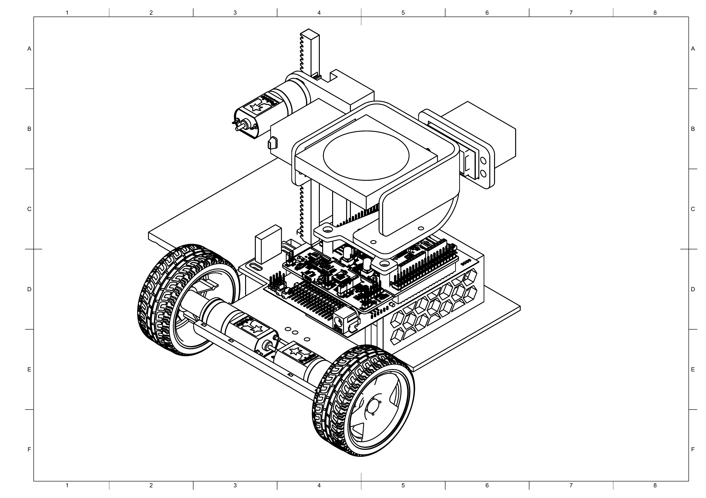

# LineXpress Robot Firmware

Firmware for the Applied Systems Engineering delivery-robot challenge. The robot follows a black line clockwise, identifies coloured pickup and delivery locations, uses a rack-mounted magnetic mechanism to handle packages, crosses the step, and stabilises a ping-pong ball tray with an IMU-controlled gimbal.

This document describes the project-specific mission code in [`main.cpp`](main.cpp). The repository-level [README](../README.md) documents the PES board, bundled drivers, and general build environment.

The project portfolio, including the concept selection, CAD views, and prototype photographs, is available as [The Transporter Portfolio](../docs/portfolio/The_Transportor_Portfolio.pdf).

## Team

### **The Transporter**

- Alberta Petiafo
- Priscilla Yeboaa Asiedu
- Samuel Kojo Akwensivie
- Godlove Bissaga
- Douglas Kumi Koomson

## Prototype concept

The final prototype uses a compact differential-drive chassis, a vertical rack-and-pinion package mechanism, magnetic package storage, and a two-degree-of-freedom gimbal tray for the ping-pong ball. The design goal is a simple, lightweight robot that can complete the package-handling mission efficiently.

### Mechanical drawings

[](../docs/cad/robot_base_Drawing_v3.pdf)

Click the drawing to open the full-resolution [Isometric View PDF](../docs/cad/robot_base_Drawing_v3.pdf).

- [Orthographic View](../docs/cad/robot_base.pdf)

## Hardware used

- STM32 Nucleo-F446RE with PES board
- Two encoder-equipped DC motors for differential drive (`M1`, `M2`)
- One encoder-equipped DC motor for the rack mechanism (`M3`)
- SparkFun line-follower sensor bar
- Colour sensor
- IMU and two RC servos for the roll/pitch gimbal
- Magnetic package pickup mechanism

The motor and sensor pins are defined in [`include/PESBoardPinMap.h`](../include/PESBoardPinMap.h).

## Demonstrated prototype capabilities

The project portfolio records the following physical prototype demonstrations:

- The colour sensor detecting a blue marker
- Transporting multiple packages while following the route
- Approaching and crossing the 10 mm trainee step with packages
- Traversing the obstacle with the ping-pong ball on the gimbal tray

The 10 mm step is the demonstrated baseline. The 20 mm and 30 mm steps remain higher-level targets that need separate validation.

## Mission flow

```text
INITIAL
  -> FIND_LINE
  -> PICKUP_APPROACH / PICKUP_ALIGNMENT / PICKUP_ACTION
  -> OVERCOME_STEP
  -> DELIVERY_APPROACH / DELIVERY_ALIGNMENT / DELIVERY_ACTION
  -> APPROACH_END
  -> MISSION_END
```

The blue Nucleo user button starts and stops the mission. The main task runs every 20 ms.

### Find line

The robot exits the depot, detects the line/cross pattern with the sensor bar, then turns left before entering `PICKUP_APPROACH`. This behaviour is calibrated for the current playing-field arrangement.

### Pickup and delivery

The colour sensor identifies a location. A colour must be detected repeatedly before the robot accepts it, helping reject one-cycle sensor noise. Completed pickup and delivery colours are stored so that the same location is not processed twice.

The firmware stores the order in which packages were picked up. During delivery, that order selects the correct magnetic storage slot on the robot.

The currently configured position table is:

| Colour | Rack target basis | Horizontal offset |
| --- | ---: | ---: |
| Red | 4 mm position | 25 mm |
| Blue | 14 mm position | 145 mm |
| Green | 4 mm position | 145 mm |
| Yellow | 14 mm position | 25 mm |

The values are represented in `package_position_by_colour` in [`main.cpp`](main.cpp). The rack target also accounts for package height and the measured distance from the rack reference to the ground.

### Gimbal

Each active control cycle reads roll and pitch from the IMU. The values are mapped to the roll and pitch servo pulse widths to keep the tray level while driving and crossing the step.

## Key calibration parameters

All of the following are current field-test values, not fixed design values. Tune one parameter at a time and record the final tested value.

| Parameter | Purpose |
| --- | --- |
| `MISSION_PERIOD` | Main-loop period; currently 20 ms. |
| `SPEED_FACTOR` | Forward speed while line following. |
| `KP`, `KD` | Line-following proportional and derivative gains. |
| `FIND_LINE_EXIT_DISTANCE` | Expected exit distance from the depot. |
| `FIND_LINE_LEFT_TURN_ANGLE_RAD` | Turn after the line/cross pattern is detected. |
| `GAP_BETWEEN_MAGNETS` | Spacing between package storage magnets. |
| `initial_rack_position` | Safe/resting rack position. |
| `package_position_by_colour` | Colour-specific rack and horizontal offsets. |

## Build and flash

The project uses PlatformIO with the Mbed framework and targets `nucleo_f446re`.

```text
PlatformIO: Build
PlatformIO: Upload
```

See the repository's [PlatformIO build guide](../docs/markdown/build_mbed_platformio.md) for setup details.

## Test checklist

Run tests in this order before attempting a full autonomous run:

1. Confirm positive motor directions and encoder readings.
2. Test rack home and both rack target heights without a package.
3. Test gimbal centring and response with the wheels stationary.
4. Tune line following on straight line and bends.
5. Tune depot exit and left turn in `FIND_LINE`.
6. Test colour filtering and pickup alignment for each colour.
7. Test pickup and delivery positions with one package, then all four.
8. Test step crossing while monitoring the gimbal.
9. Run the full mission repeatedly and record successful/failed runs.

## Current development notes

- `EMERGENCY_STOP` is reserved for the planned mechanical-switch safety behaviour.
- Serial `printf()` statements are currently useful for testing state transitions. Disable or reduce them for timing-sensitive final runs.
- Final CAD renders, wiring photographs, and measured calibration results should be added here when available.
- The project portfolio contains the concept scoring, CAD views, and prototype photographs.
